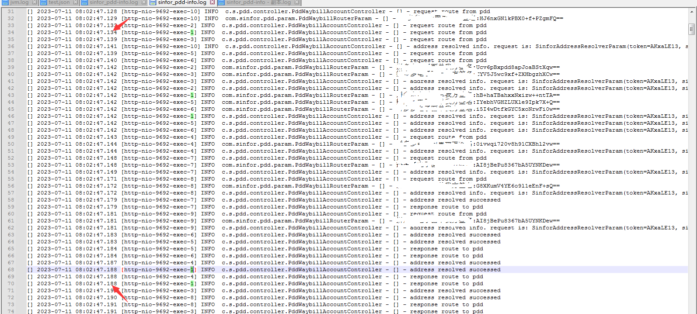

# 一次Nginx499状态码排查


## 起因

公司对接某多多，其中有个获取地址抬头接口链路如下

多多 ---http调用--> 我接口 ---> http调用c#地址解析接口

多多要求整个链路时间不超过500ms，否则认为超时。则造成热敏单打印出来无抬头。


当时接口通过ab压测，1000个请求 10个并发的情况下 并无问题出现，基本都是200ms内正常返回。偶现一个较慢情况是因为c#端垃圾回收会回收整个运行环境，导致第一次请求较慢。这个后来已经优化。


## 线上问题

上线后，网点反馈打不出抬头。查看日志，发现有超时。

预想的情况是  我接口只负责验签和转发而已。并无耗时逻辑。
仅仅一次拼参数和一次网络请求，理应是10ms内的处理时间。
所以整个耗时链路是   多多->我接口的网络耗时+处理耗时（10ms)+我请求c#的网络耗时+c#处理耗时(100ms内)


查看日志发现，有线程上下文切换以及线程阻塞情况。

考虑到有部分服务器比较老旧，可能都是5-10年往上，而且是在虚拟机里跑的服务。且里面还有很多别的应用在跑，而且本身这个代码服务里还有很多别的接口，而且还有个接口一直在被轮询。（不说了，buff叠满了）
所以认为是产生了线程切换cpu被抢占

第一次优化，将该接口抽取出来，并做一些逻辑简化（如去掉日志切面避免动态代理，去掉System.currentTimestamp避免访问系统内核，简化部分日志）

修改nginx配置，将该服务部署到独立机器，且只有该接口落到新的机器上，这样也能兼容老的接口不受影响（因为要在多多平台配置域名）。


上线后第二天用户仍然反馈有之前抬头未打出情况。
查看日志，基本耗时都非常快，即便有并发情况，查看几个线程仍然在要求时间内能正常返回。



遂找到用户具体参数，在整个集群内日志进行搜索，发现未出现该参数，这个情况就有点奇怪了。好像就是多多并未发送请求一样。
之后找到多多的对接人员，询问具体请求，他排查的情况是出现了Timeout，Read Time out Exception. 让我这边排查下是否是网络抖动或者程序阻塞。


现在的情况是  多多发送了请求，但是我这边并未出现处理日志。难道真的是网络波动了？
找到生产环境的nginx，查看了下access.log文件，发现当天有900多M，大文件cat肯定不行，用less + awk和sed这些命令分片操作了下，大概如下
先用less分页定位到了打单前后一分钟的具体时间点，因为可能存在机器时间不一致。所以想法是找那一分钟的日志。
然后用sed具体时间点查询那一分钟前后的所有日志，这两个时间点必须要存在，否则会刷全日志，导致终端直接卡死。
```shell
sed -n '/2023:16:35:47/,/2023:16:36:47/p' access-2023-07-13.log
```
这一分钟的日志grep该路由

```shell
sed -n '/2023:16:35:47/,/2023:16:36:47/p' access-2023-07-13.log | grep /route/rule | less
```
到这一步其实就已经发现问题了，发现该分钟内有不少的499状态码

到这一步顺便回忆了下一些大日志操作，顺便记录下

```shell
# 将这分钟日志写入快照temp.log文件中
sed -n '/2023:16:35:47/,/2023:16:36:47/p' access-2023-07-13.log >> temp.log
# 根据关键字/route/rule查询前后五行，-A为后五行 -B是前五行 -C为前后
grep -C 5 '/route/rule' temp.log
# awk根据指定符号或者默认空格和换行进行分割
awk '$9!=200 {print}' access.log
# 也可以指定符号，如指定:分割,NR为行号，wc -l 统计行数
awk -F: '$2>200 {print NR}' access.log | wc -l
```


到此处，发现499的很多。根据状态码描述了解到是因为客户端设置了readTimeout超时时间，时间内未响应nginx就会直接499并且不继续转发请求了。
所以具体应用端无日志产生。

我这边也写了测试复现了下，确实会有这种情况


问题定位到了，但是怎么解决，又是个头痛的问题。
根据上诉链路分析，应用里并无耗时逻辑。分析大概率还是网络波动或者阻塞的情况。

和总监聊了下，因为当前nginx下代理了很多个应用，总体流量相对比较大。
将该服务的nginx拆出去单独进行代理，先跑两天看看效果会不会好点。

然后又根据情况，完善了下耗时日志，用ab继续进行压测了下。发现转发应用确实没有问题。
根据ab的耗时，偶尔会出现一条1000ms的请求，但是应用日志的耗时也只有200ms。说明还是在网络io损耗了大量时间。


