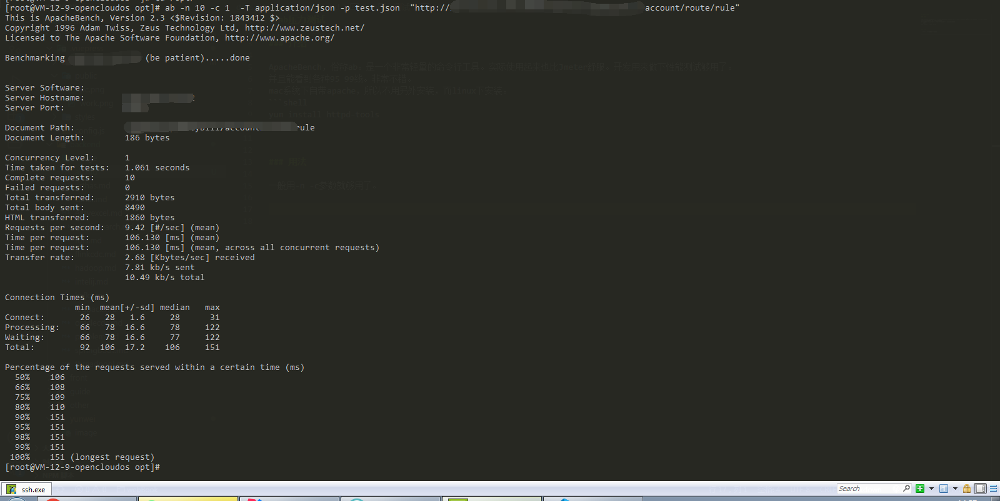

# ab性能测试

### 介绍

ApacheBench，俗称ab。是一个非常轻量的命令行工具。实际使用起来也比Jmeter舒服。开发用来做下性能测试够用了。
并且能看到各种95 99线。非常不错。
mac系统下自带apache，所以不用另外安装，而linux下安装。
```shell
yum install httpd-tools
```


### 用法

一般用-n -c参数就够用了。如下，-n 10个请求， -c 1个并发
```shell
ab -n 10 -c 1  -T application/json -p test.json  "http://localhost:8080/route/rule"
```
可以看到100%的请求都在151ms以下，且50%的请求都在106ms以下。




get请求直接去掉-p参数就ok 