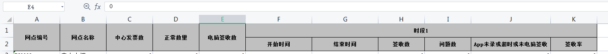
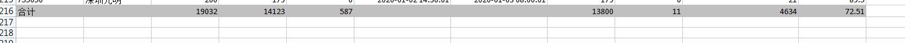

# EasyExcel使用


其实官方文档已经讲的很清楚了，[官方文档](https://easyexcel.opensource.alibaba.com/docs/current/)，但使用过程中有几点值得记录的点。


## 导出复杂表头

如图所示，像这种表头直接在注解里就能得到解决



```java
@Data
@ColumnWidth(14)
@HeadRowHeight(25)
@HeadFontStyle(fontHeightInPoints = 10, bold = BooleanEnum.TRUE)
@HeadStyle(fillForegroundColor = 22, locked = BooleanEnum.TRUE)
public class ExcelRow {

    @ExcelProperty(value = "编号")
    private String siteId;
    @ExcelProperty(value = "名称")
    private String siteName;
    @ExcelProperty(value = "xx数量")
    private Integer centerSend;
    @ExcelProperty(value = "xx数量")
    private Integer enter;
    @ExcelProperty(value = "xx数量")
    private Integer pcEnter;
    @ColumnWidth(20)
    @DateTimeFormat("yyyy-MM-dd HH:mm:ss")
    @ExcelProperty(value = {"时段1", "开始时间"})
    private Date beginTime;
    @ColumnWidth(20)
    @DateTimeFormat("yyyy-MM-dd HH:mm:ss")
    @ExcelProperty(value = {"时段1", "结束时间"})
    private Date endTime;
    @ExcelProperty(value = {"时段1", "xx数量"})
    private Integer appEnter;
    @ExcelProperty(value = {"时段1", "问题数"})
    private Integer appProblem;
    @ColumnWidth(24)
    @ExcelProperty(value = {"时段1", "xx数量"})
    private Integer appNotEnterOrLaterCount;
    @ExcelProperty(value = {"时段1", "签收率"})
    private BigDecimal appSignRate;
}

```

## 最后使用合计行

issues给了个大概的解决方案，是用两个table导出数据，后面的table不用标题行。做成合计就OK

```java
    private void writeData(String tempFilePath) {
        // 管你从哪获取数据
        List<ExcelRow> excelDataList = getFromAnyWhere();
        ExcelWriter excelWriter = null;
        try {
            excelWriter = EasyExcel.write(tempFilePath, ExcelRow.class).build();
            WriteSheet writeSheet = EasyExcel.writerSheet("sheetName").needHead(Boolean.FALSE).build();
            WriteTable table0 = EasyExcel.writerTable(0).needHead(Boolean.TRUE).build();
            WriteTable table1 = EasyExcel.writerTable(1).needHead(Boolean.FALSE)
                    .registerWriteHandler(getHorizontalCellStyleStrategy()).build();

            excelWriter.write(excelDataList, writeSheet, table0);
            excelWriter.write(sumTotal(excelDataList), writeSheet, table1);
        } finally {
            if (excelWriter != null) {
                excelWriter.finish();
            }
        }
    }

```
```java
    /**
     * 合计行样式
     **/
    private HorizontalCellStyleStrategy getHorizontalCellStyleStrategy() {
        WriteCellStyle contentWriteCellStyle = new WriteCellStyle();
        contentWriteCellStyle.setFillPatternType(FillPatternType.SOLID_FOREGROUND);
        contentWriteCellStyle.setFillForegroundColor(IndexedColors.GREY_25_PERCENT.getIndex());
        return new HorizontalCellStyleStrategy(null, contentWriteCellStyle);
    }
```

```java
    private List<ExcelRow> sumTotal(List<ExcelRow> dataList) {
        // 内存中汇总结果
        int centerSend = dataList.stream().mapToInt(ExcelRow::getCenterSend).sum();

        List<ExcelRow> suffixList = new ArrayList<>();
        ExcelRow sumRow = new ExcelRow();
        sumRow.setSiteId("合计");
        sumRow.setCenterSend(centerSend);
        sumRow.xxx
        sumRow.xxx
        sumRow.xxx
        sumRow.xxx
        BigDecimal rate;
        if (centerSend != 0) {
            rate = BigDecimal.valueOf(appEnter).divide(BigDecimal.valueOf(centerSend),
                    4, RoundingMode.HALF_UP).multiply(BigDecimal.valueOf(100));
        } else {
            rate = BigDecimal.ZERO;
        }
        sumRow.setAppSignRate(rate);
        suffixList.add(sumRow);
        return suffixList;
    }
```

最终效果


## 注意
3.0x的版本和最新的3.1/3.2的版本不同，3.0的版本使用table导出的时候无法使用try with resource语法，io流需自己关闭。