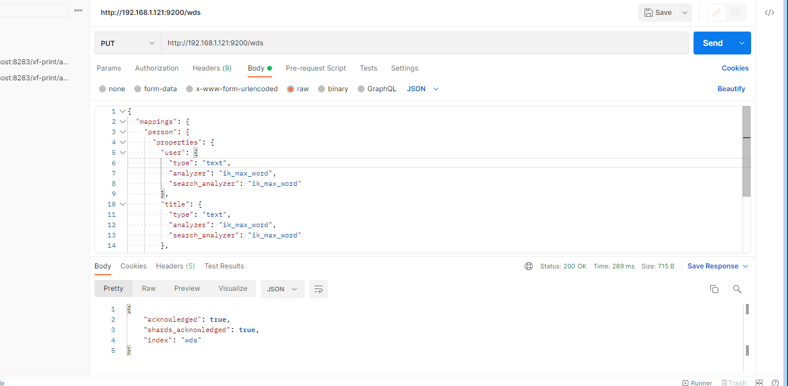
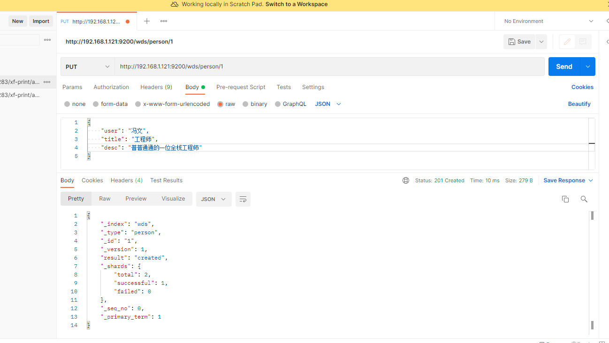
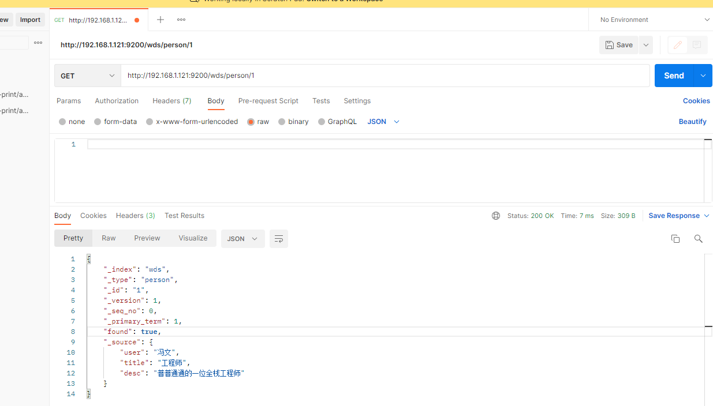

# Elasticsearch

## 安装
目前ES已经到了8.7.0的版本，我这边选了个6.8.20的版本使用,同时es也依赖jdk环境。这里不做赘述。
[下载地址](https://www.elastic.co/downloads/past-releases#elasticsearch)

直接复制对应版本链接选中wget就好
```shell
wget https://artifacts.elastic.co/downloads/elasticsearch/elasticsearch-6.8.20.tar.gz

tar -xzvf elasticsearch-6.8.20.tar.gz
```

## 配置

简单修改下集群名称和节点名称，使用单机使用下
```shell
vim config/elasticsearch.yml
```

```shell
// 去掉行开头的 # 并重命名集群名，这里命名为 compass
cluster.name: mycluster
// 去掉行开头的 # 并重命名节点名，这里命名为 node-1
node.name: node001
```

## 启动
进入bin目录后台启动,可先按下面问题进行配置后再启动
```shell
./elasticsearch -d
```
启动后curl localhost:9200能正常返回json就ok


### 新建用户

这里启动有个问题(5版本之后)，不能使用root用户启动。日志可以在logs下mycluster.log看到，所以先建个用户
```shell
adduser fengwen
passwd fengwen

# 输入确认密码后
chown -R fengwen elasticsearch-6.8.20

su fengwen
```

### 修改ip
调整只能本地访问问题，修改yml配置后重新启动
```shell
vim config/elasticsearch.yml

# 修改network.host
network.host: 0.0.0.0
```

### 文件数过小
查看日志发现还是无法启动，分别为每个进程同时打开的文件数太小、最大线程个数太低、一个进程最多的内存区域太小


```shell
# 1.最大线程数和文件数，修改limits.conf配置，用户退出后重新登录生效
vim /etc/security/limits.conf

# 文件数
* soft nofile 65535
* hard nofile 65535

# 最大线程数
* soft nproc 4096
* hard nproc 4096

# 2.最多的内存区域大小,修改sysctl.conf配置，sysctl -p后生效
vim /etc/sysctl.conf
# 增加如下配置
vm.max_map_count=262144

# 使生效
sysctl -p
```

## 分词器
安装对应版本的ik中文分词器
[分词器地址](https://github.com/medcl/elasticsearch-analysis-ik/tags?after=v6.8.23)
```shell
./bin/elasticsearch-plugin install https://github.com/medcl/elasticsearch-analysis-ik/releases/download/v6.8.20/elasticsearch-analysis-ik-6.8.20.zip
```

重启es，这样es就会自动加载分词器

## Kibana安装

还有一种GUI是使用elasticsearch-head,这种chrome插件已经不支持了，同样需要node环境启动，我这里记录下。

[kibana官网](https://www.elastic.co/downloads/kibana)
注意下kibana和ES的版本对应
[版本对应](https://www.elastic.co/cn/support/matrix#matrix_compatibility)

修改下config/kibana.yml，将端口和elasticesearch的注释取消掉。然后把kibana的ip从localhost改成0.0.0.0。启动
```shell
nohup bin/kibana &
```

如果没有nohub命令，注意切换root后
```shell
yum install coreutils
```

## ES基本概念

index相当于数据库中的库
type相当于数据库中的表

下面这个数据相当于新建了个库，里面有一个person的type,person有三个字段：user、title、desc，这三个字段都是中文，类型都是文本。所以指定了中文分词器。

```json
{
  "mappings": {
    "person": {
      "properties": {
        "user": {
          "type": "text",
          "analyzer": "ik_max_word",
          "search_analyzer": "ik_max_word"
        },
        "title": {
          "type": "text",
          "analyzer": "ik_max_word",
          "search_analyzer": "ik_max_word"
        },
        "desc": {
          "type": "text",
          "analyzer": "ik_max_word",
          "search_analyzer": "ik_max_word"
        }
      }
    }
  }
}
```


针对该type新增一条数据


查询该数据


[数据同步看这篇文章](./canal.md)