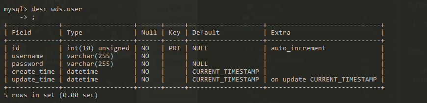
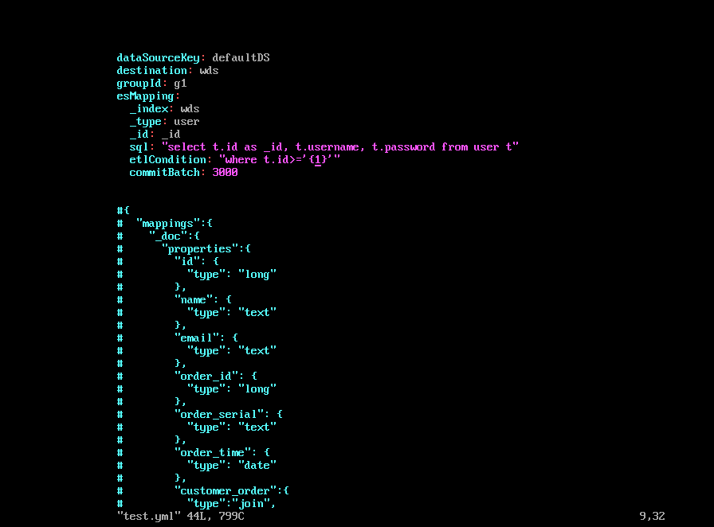
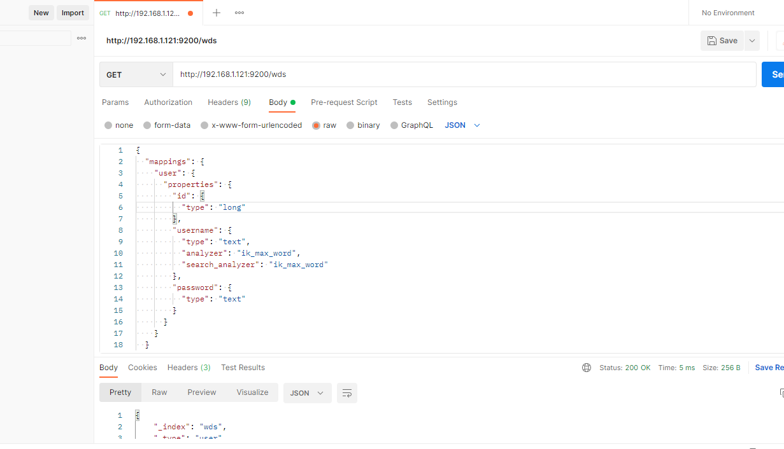
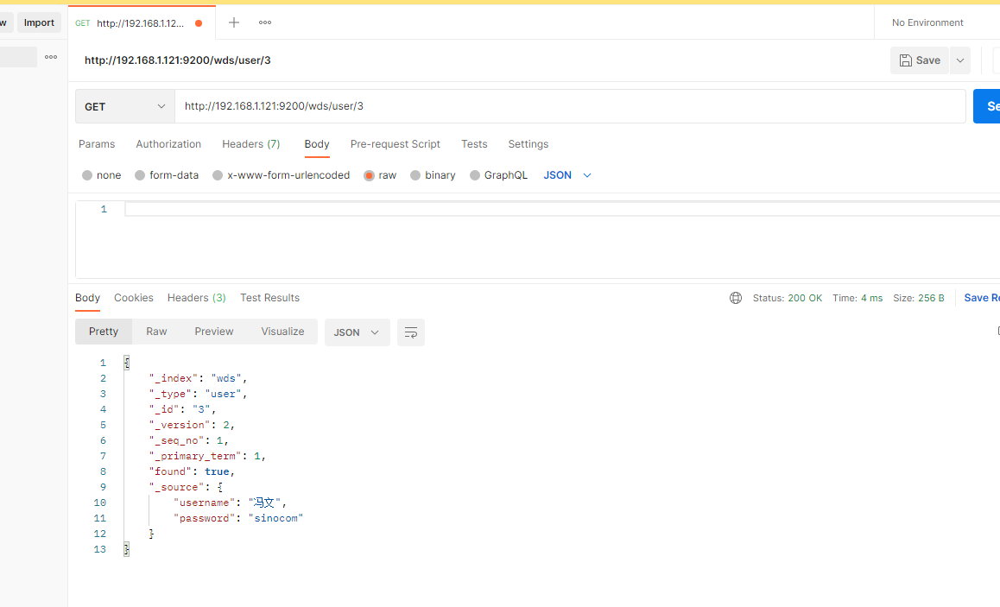

# Elasticsearch

## 安装
目前ES已经到了8.7.0的版本，我这边选了个6.8.20的版本使用,同时es也依赖jdk环境。这里不做赘述。
[下载地址](https://www.elastic.co/downloads/past-releases#elasticsearch)

直接复制对应版本链接选中wget就好
```shell
wget https://artifacts.elastic.co/downloads/elasticsearch/elasticsearch-6.8.20.tar.gz

tar -xzvf elasticsearch-6.8.20.tar.gz
```

## 配置

简单修改下集群名称和节点名称，使用单机使用下
```shell
vim config/elasticsearch.yml
```

```shell
// 去掉行开头的 # 并重命名集群名，这里命名为 compass
cluster.name: mycluster
// 去掉行开头的 # 并重命名节点名，这里命名为 node-1
node.name: node001
```

## 启动
进入bin目录后台启动,可先按下面问题进行配置后再启动
```shell
./elasticsearch -d
```
启动后curl localhost:9200能正常返回json就ok


### 新建用户

这里启动有个问题(5版本之后)，不能使用root用户启动。日志可以在logs下mycluster.log看到，所以先建个用户
```shell
adduser fengwen
passwd fengwen

# 输入确认密码后
chown -R fengwen elasticsearch-6.8.20

su fengwen
```

### 修改ip
调整只能本地访问问题，修改yml配置后重新启动
```shell
vim config/elasticsearch.yml

# 修改network.host
network.host: 0.0.0.0
```

### 文件数过小
查看日志发现还是无法启动，分别为每个进程同时打开的文件数太小、最大线程个数太低、一个进程最多的内存区域太小


```shell
# 1.最大线程数和文件数，修改limits.conf配置，用户退出后重新登录生效
vim /etc/security/limits.conf

# 文件数
* soft nofile 65535
* hard nofile 65535

# 最大线程数
* soft nproc 4096
* hard nproc 4096

# 2.最多的内存区域大小,修改sysctl.conf配置，sysctl -p后生效
vim /etc/sysctl.conf
# 增加如下配置
vm.max_map_count=262144

# 使生效
sysctl -p
```

## 分词器
安装对应版本的ik中文分词器
[分词器地址](https://github.com/medcl/elasticsearch-analysis-ik/tags?after=v6.8.23)
```shell
./bin/elasticsearch-plugin install https://github.com/medcl/elasticsearch-analysis-ik/releases/download/v6.8.20/elasticsearch-analysis-ik-6.8.20.zip
```

重启es，这样es就会自动加载分词器

## Kibana安装

还有一种GUI是使用elasticsearch-head,这种chrome插件已经不支持了，同样需要node环境启动，我这里记录下。

[kibana官网](https://www.elastic.co/downloads/kibana)
注意下kibana和ES的版本对应
[版本对应](https://www.elastic.co/cn/support/matrix#matrix_compatibility)

修改下config/kibana.yml，将端口和elasticesearch的注释取消掉。然后把kibana的ip从localhost改成0.0.0.0。启动
```shell
nohup bin/kibana &
```

如果没有nohub命令，注意切换root后
```shell
yum install coreutils
```

## ES基本概念

index相当于数据库中的库
type相当于数据库中的表

下面这个数据相当于新建了个库，里面有一个person的type,person有三个字段：user、title、desc，这三个字段都是中文，类型都是文本。所以指定了中文分词器。

```json
{
  "mappings": {
    "person": {
      "properties": {
        "user": {
          "type": "text",
          "analyzer": "ik_max_word",
          "search_analyzer": "ik_max_word"
        },
        "title": {
          "type": "text",
          "analyzer": "ik_max_word",
          "search_analyzer": "ik_max_word"
        },
        "desc": {
          "type": "text",
          "analyzer": "ik_max_word",
          "search_analyzer": "ik_max_word"
        }
      }
    }
  }
}
```


针对该type新增一条数据


查询该数据


## 数据同步

### 概念
在大多数情况下，我们使用的是RDBMS。但是随着业务的增长，为了适应各种各样的运营需求，如各类报表，各类业务指标等。不得不做出去规范化的操作。
一般的操作如下：

* 列级处理

::: tip
冗余字段
:::

在我还是一个刚工作不久在一家体量不是很大的公司工作的时候，为了满足老板有时候奇奇怪怪的需求，不得不去破坏标标致致的表结构，比如在什么订单表上去存储一个奇奇怪怪的字段。这种操作让自己很难受同时也很难像别人解释，到最后大家不得不去每次别捏的看到这个字段在一个设计的很不错的数据表上。

* 表级处理

::: tip
构建宽表，同步写入
:::
这种操作也不是没有，但是我从来没这么干过 - -！，大概的意思是昨晚业务操作后，再塞一个DO到宽表中，方便后续运营数据的查询。

::: tip
RDBMS物化视图
:::
视图的方式我目前这家公司就有很多，由于很多业务系统年代久远且数据库用的Oracle(总监07年过来的，已经快50岁了),据说2000年左右这种方式非常普遍。

::: tip
数据迁移 -> ES、OLAP等
:::
这种就是借助一些大数据工具或者一些开源的数据同步工具等，对数据进行迁移到ES或者Hive等数据库中，同时方案也是各种各样，工具也是非常多。如阿里云和腾讯的DTS、AWS的DMS、大数据的Sqoop、Datax以及Oracle也有GoldenGate、开源的canal等等


当然回归到数据同步到ES，这里可选的一些方案

* 双写

不知道大家有无做过需要双写的系统，代码十分累赘，尤其是老系统的改造对改代码的人来说非常痛苦。

* MQ

这种其实和双写差不多，不过中间加了层MQ，双写的同时还加入了MQ组件，复杂度更高了。

* Datax

完全不用对业务代码进行改造，缺点是他只能做全量同步，如果时效性不高，可以考虑。或者和其他混合使用。

* Canal

也不用改造业务代码，且是实时同步的方式。


###

选用canal做数据同步

#### 1.开启mysql的binlog(自建，阿里云上的默认开启)

```shell
vim /etc/my.cnf

# 配置
[mysqld]
log-bin=mysql-bin # 开启 binlog
binlog-format=ROW # 选择 ROW 模式
server_id = 1
```
重启mysql，查看配置是否成功
```shell
show variables like 'log_bin%';

show variables like 'binlog_format%';
```

创建canal用户连接mysql并赋予读取binlog权限

```shell
mysql> grant all on *.* to canal@'%' identified by 'canal';

mysql> flush privileges;
```


#### 2.下载canal相关组件，我用的1.1.3

1.下载deployer组件，修改conf下面的canal.properties

```shell
mkdir -p /usr/local/canal-server
cd /usr/local/canal-server

wget https://github.com/alibaba/canal/releases/download/canal-1.1.3/canal.deployer-1.1.3.tar.gz

tar -xzvf canal.deployer-1.1.3.tar.gz
vim conf/canal.properties

# 修改下面两项
canal.instance.parser.parallel = false # 单cpu关闭此配置
canal.destinations = wds #这个是很重要的参数，在这里指定你要创建的实例的名字，比如test1，test2等，逗号隔开

```

修改完配置后，要在conf目录下拷贝example到新目录wds
```shell
cp -a example/ wds
```

修改wds中的instance.properties
```shell
canal.instance.master.address=127.0.0.1:3306　#指定要读取binlog的MySQL的IP地址和端口
canal.instance.master.journal.name=　　　　 #从指定的binlog文件开始读取数据
canal.instance.master.position=　　　　#指定偏移量，做过主从复制的应该都理解这两个参数。
　　　　　　　　　　　　　　　　　　　 #tips：binlog和偏移量也可以不指定，则canal-server会从当前的位置开始读取。我建议不设置
canal.instance.dbUsername=canal　　#指定连接mysql的用户密码
canal.instance.dbPassword=canal  
canal.instance.connectionCharset = UTF-8　　　　　　　　　　　　 #字符集

canal.instance.filter.regex=.*\\..*　　　　　　　　　　　　　　　　#这个是比较重要的参数，匹配库表白名单，比如我只要wds库的user表的增量数据，则这样写 wds.user
```

启动deployer
```shell
./bin/startup.sh

tail -f logs/canal/canal.log
```

2.下载canal-adapter组件
```shell
mkdir -p /usr/local/canal-adapter
cd /usr/local/canal-adapter

wget https://github.com/alibaba/canal/releases/download/canal-1.1.3/canal.adapter-1.1.3.tar.gz

tar -xzvf canal.adapter-1.1.3.tar.gz
```

修改application.yml 主要的参数
```shell
grep -v "^#" application.yml
```
```yml
server:
  port: 8081
spring:
  jackson:
    date-format: yyyy-MM-dd HH:mm:ss
    time-zone: GMT+8
    default-property-inclusion: non_null

canal.conf:
  mode: tcp # kafka rocketMQ　　　　　　　　　　　　　　#模式
  canalServerHost: 127.0.0.1:11111　　　　　　　　　　 #指定canal-server的地址和端口
  batchSize: 500
  syncBatchSize: 1000
  retries: 0
  timeout:
  accessKey:
  secretKey:
　　srcDataSources:　　　　　　　　　　　　　　　　　　　　#数据源配置，从哪里获取数据
　　  defaultDS:　　　　　　　　　　　　　　　　　　　　　　#指定一个名字，在ES的配置中会用到，唯一
　　    url: jdbc:mysql://127.0.0.1:3306/wds?useUnicode=true　　　　#连接的数据库地址和一个库
　　    username: root　　　　　　　　　　　　　　　　　　　　　　　　　　　　　#数据库的用户和密码
　　    password: 121212

  canalAdapters:　　　　　　　　　　　　　　　　　　　　#适配器配置
  - instance: wds # canal instance Name or mq topic name　　　　#指定在canal-server配置的实例
    groups:
    - groupId: g1　　　　　　　　　　　　　　　　　　　　　　　　　　　　　　#默认就好，组标示
      outerAdapters:　　　　　　　　　　　　　　　　　　　　　　　　　　　　#输出
      - name: es　　　　　　　　　　　　　　　　　　　　　　　　　　　　　  #输出到哪里？指定es
　　    hosts: 127.0.0.1:9300　　　　　　　　　　　　　　　　　　　　　　　#指定es的地址，注意端口为es的传输端口9300
　　    properties:　　　　　　　　　　　　　　　　　　
　　      cluster.name: mycluster　　　　　　　　　　　　　　　　　　　　　　　　　#指定es的集群名称
```


配置es部分

我要同步的表为



```shell
# es目录下有三个示例配置文件，可删除，也可用来参考

cp /usr/local/canal-adapter/conf/es/mytest_user.yml user.yml

vim user.yml
```



新建对应的es index。index为wds，type为user，三个属性如下




启动canal-adapter，开始同步数据

```shell
./bin/startup.sh
```

启动后先做一次全量同步
```shell
curl http://127.0.0.1:8081/etl/es/test.yml -X POST
```

后续在数据库中新增数据，查看数据是否能正常同步

查看es数据

