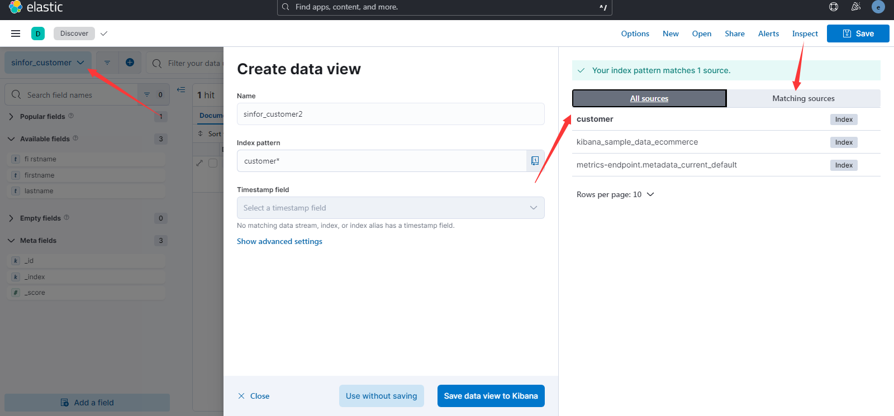
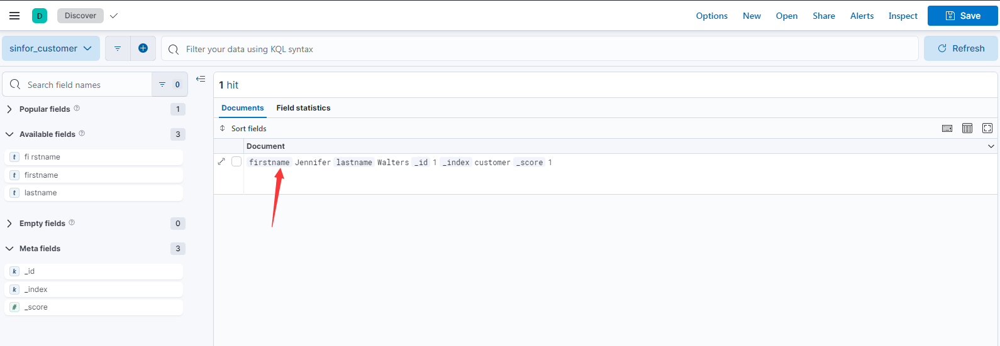

# ELK+Filebeat的搭建

elastic是一个大生态，elasticsearch是其内部最重要的一个组件。官网推荐的elk+Beats收集各种日志方案看着很不错。
流程是 客户机上安装filebeat收集应用日志(filebeat是一个go写的很轻量的应用，对比logstash或者flume来讲太友好了，不会吃掉太多资源，而且他能自动降低高峰下的自身速率)，然后发给logstash做过滤和处理（这里如果logstash处理力有限可以加机器或者考虑用kafka）
然后logstash再output到es内。 最终kibana上做一个结果展示

## 1.Elasticsearch

目前最新的是8.8版本，花费了大量时间查看了es官网的文档，大概对其一些特性有了个了解，比如7之后把6版本的分片数量由5减小了，具体怎么个改法的我还是有点没弄懂 - -！ 配置项真的很多 [链接](https://www.elastic.co/guide/en/elasticsearch/reference/8.8/misc-cluster-settings.html) 不过也有在索引文档里看到有些说分片默认是为1[链接](https://www.elastic.co/guide/en/elasticsearch/reference/8.8/index-modules.html)，内置了个jdk，支持了跨集群复制等，8之后加了个安全证书等等。

### 1.1安装
根据官网的安装步骤下载安装es

```shell
wget https://artifacts.elastic.co/downloads/elasticsearch/elasticsearch-8.8.0-linux-x86_64.tar.gz
wget https://artifacts.elastic.co/downloads/elasticsearch/elasticsearch-8.8.0-linux-x86_64.tar.gz.sha512

# 这个shasum没有的话 yum install perl-Digest-SHA -y
shasum -a 512 -c elasticsearch-8.8.0-linux-x86_64.tar.gz.sha512 
tar -xzf elasticsearch-8.8.0-linux-x86_64.tar.gz
cd elasticsearch-8.8.0/ 
```

官网补充 验证成功后会输出下面语句  且会自动把路径加到了ES_HOME的环境变量中了
```
Compares the SHA of the downloaded .tar.gz archive and the published checksum, which should output elasticsearch-{version}-linux-x86_64.tar.gz: OK.

This directory is known as $ES_HOME.
```

### 2.启动
因为不能使用root用户启动es，所以提前建好用户，给好文件权限。

```shell
groupadd elastic
useradd -g elastic elastic

chown -R elastic:elastic /usr/local/elasticsearch-8.8.0

# 为了方便建软链接
ln -sv /usr/local/elasticsearch-8.8.0 /app/elasticsearch
chown -R elastic:elastic /app/elasticsearch
```

建好用户后，切换到elastic用户下，启动es，启动之前最好改下config/elasticsearch.yml，具体可见[官方配置说明](https://www.elastic.co/guide/en/elasticsearch/reference/8.8/settings.html)
```shell
# 集群名称
cluster.name: logging-test
# 节点名称
node.name: loggin-test-node01
# data目录，默认$ES_HOME/data
# logs目录，默认$ES_HOME/logs

# 集群引导配置，只需要首次启动集群时需要。集群形成后从每个节点删除此配置。不然之后的错误配置可能会引导出一个新集群。可以根据集群uuid判断。
cluster.initial_master_nodes: ["loggin-test-node01"]

# 有主节点资格的节点地址，不过如果是单节点的话不用配这个，不然一直会刷warn警告。
discovery.seed_hosts:
    - 192.168.1.10:9300

# 如果其他节点要接入集群 需要走的ip，配置了这个值后，es会默认认为你是在配生成环境，会升级配置检查
network.host: 192.168.1.10
```

同时如果内存吃不消可以改下config下其他配置，在jvm.options里，不过我32G的内存就不用动了。默认就好(默认会吃掉我一半内存- -！)
同时，由于我这台机器资源比较充足，如果小的机器可能要配置下最大线程数等问题，我之前在虚拟机上装6.x的es时会有那个问题。具体也可看官网系统配置[系统配置](https://www.elastic.co/guide/en/elasticsearch/reference/8.8/setting-system-settings.html)
```
# 1.最大线程数和文件数，修改limits.conf配置，用户退出后重新登录生效
vim /etc/security/limits.conf

# 文件数
* soft nofile 65535
* hard nofile 65535

# 最大线程数
* soft nproc 4096
* hard nproc 4096

# 2.最多的内存区域大小,修改sysctl.conf配置，sysctl -p后生效
vim /etc/sysctl.conf
# 增加如下配置
vm.max_map_count=262144

# 使生效
sysctl -p
```


8版本的es首次启动时会给你打印出一些安全功能的日志，最好记录下来，免得后面找不到，那个sha256的TLS证书指纹后面beats要用到。

1.elastic超级用户的密码。
2.30分钟内有效的kibana token
3.生成传输层和http层要用的TLS证书和密钥，并打印出sha-256后的指纹证书

首次直接交互式启动，方便排查错误跟记录密钥，同时首次启动后es会在config/elasticsearch.yml最后拼上x-pack相关的安全配置
```shell
su elastic
./bin/elasticsearch 

# 记录密钥后杀掉es进程重新后台启动。当前目录下记录pid，之后停止es直接pkill -F pid
./bin/elasticsearch -d -p elasticsearch.pid
./bin/elasticsearch -h # 查看帮助
```

同时这个版本会打印出一些slf4j相关的如no provider的warn级别日志，我看issues已经有人提出来了，他们也说会在下个版本修复。


验证es启动正常，可以查看9200端口或者执行下面命令
前面说了8.0之后加了TLS证书，所以必须使用https，同时ES_HOME这个环境变量如果你是root用户解压的压缩包，可能在es用户下无法找到环境变量，直接切回root或者最好自己配下/etc/profile，不然谁知道他什么时候又用到这个变量。
```shell
curl --cacert $ES_HOME/config/certs/http_ca.crt -u elastic https://localhost:9200 

# 输入上面命令后，会要求你输入超级用户elastic的密码，直接将之前记录的elastic用户密码考进去。能正常返回json的节点信息就ok
```


### 3.curd

curl直接新增数据，可以直接去掉[]用 user:password输入密码
```shell
curl --cacert $ES_HOME/config/certs/http_ca.crt -u elastic[:password] -X POST "https://localhost:9200/customer/_doc/1?pretty" -H 'Content-Type: application/json' -d' {   "firstname": "Jennifer",   "lastname": "Walters" } '

curl --cacert ./http_ca.crt -u elastic:password -X GET "https://localhost:9200/customer/_doc/1?pretty"


```


## 2.Kibana

kibana也是一个重量级的应用，压缩文件都有264M，他不再仅仅是一个es的可视化工具了。具体可看[官方文档](https://www.elastic.co/guide/en/kibana/8.8/introduction.html)，说实话，如果只是为了可视化es数据，kibana有点过于重量级了，他是整个Elastic Stack生态的管理工具。但他还和一些云厂商的日志平台一样，提供如KQL等功能帮助快速搜索日志，还有丰富的仪表盘等功能等。


### 2.1安装
```shell
curl -O https://artifacts.elastic.co/downloads/kibana/kibana-8.8.1-linux-x86_64.tar.gz
curl https://artifacts.elastic.co/downloads/kibana/kibana-8.8.1-linux-x86_64.tar.gz.sha512 | shasum -a 512 -c - 
tar -xzf kibana-8.8.1-linux-x86_64.tar.gz
cd kibana-8.8.1/ 
```

因为要用到用户连接elasticsearch，所以最好先去elasticsearch下重置下内置用户kibana_system的密码
```shell
elasticsearch-reset-password -u kibana_system
```


### 2.2配置&启动
修改了下配置 config/kibana.yml  kibana的配置同样不算少，具体可以跟着官网走，但是重要的如下。我的配置项

```shell
server.port: 5601
server.host: "0.0.0.0"
elasticsearch.hosts: ["https://localhost:9200"]
elasticsearch.username: "kibana_system"
elasticsearch.password: "xxxx"
elasticsearch.pingTimeout: 1500
elasticsearch.requestTimeout: 30000
elasticsearch.maxSockets: 1024
elasticsearch.compression: false
elasticsearch.shardTimeout: 30000
elasticsearch.ssl.verificationMode: none
```

```shell
nohup ./bin/kibana &
```

第一次启动后去页面访问可能要你输入kibana的token，这个是之前启动elasticsearch打印出来的。如果过了半个小时则可以重新生成
```shell
bin/elasticsearch-create-enrollment-token -s kibana
```

### 2.3创建视图
启动后，进入discovery之后，就可以创建视图了，不过要先有数据，一个视图对应到一个或多个索引或数据流。
保存时还可以作为临时视图，这样别人就看不见你创建的视图了。关于Discover页面的用法，相信之前用过阿里的日志平台的可太熟悉了。



### 2.4官网示例
启动kibana后，官网有个示例数据的例子，可以跟着熟悉下kibana用法
[kibana示例数据](https://www.elastic.co/guide/en/kibana/8.8/get-started.html)


### 2.5开发工具
kibana自带了很好用的开发工具，后续我们用到logstash去做过滤的时候匹配自己的日志格式要用到grok表达式、以及查询分析es索引的时候，有网页版的console。非常好用。[开发工具地址](https://www.elastic.co/guide/en/kibana/8.8/xpack-grokdebugger.html)

### 2.6用户管理
和其他国外的软件很像，如confluence或者jenkins等，kibana有一套自己的页面权限。 如我不需要给普通用户太多复杂的功能，直接创建一个新的空间，只需要仪表盘和Discover跟Stack Management的功能。新空间和默认的空间是隔离开的，数据视图也是隔离开的。所以更像是给不同部门或组开新空间。

然后添加新的角色，给角色分配空间，然后选择可以操作的索引。以及kibana页面权限。 比如给某个空间的管理员放开Stack Managerment的权限。而普通用户只需要Discover和Dashboard的权限。

添加用户，分配对应角色。


建完空间、角色、用户后，整个kibana的配置就ok了。


## 3.Filebeat
新版本的logstash推荐你使用filebeat去收集web日志。


### 2.1安装
```shell
curl -L -O https://artifacts.elastic.co/downloads/beats/filebeat/filebeat-8.8.1-linux-x86_64.tar.gz
tar xzvf filebeat-8.8.1-linux-x86_64.tar.gz
```


## 2.Logstash   

起初认为logstash也是个轻量的进程，下完压缩包后发现300多m，其还和es一样，还内置了个17版本jdk.

关于Logstash[官方文档](https://www.elastic.co/guide/en/logstash/current/first-event.html)


