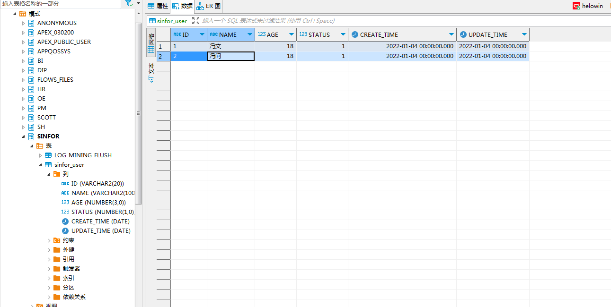
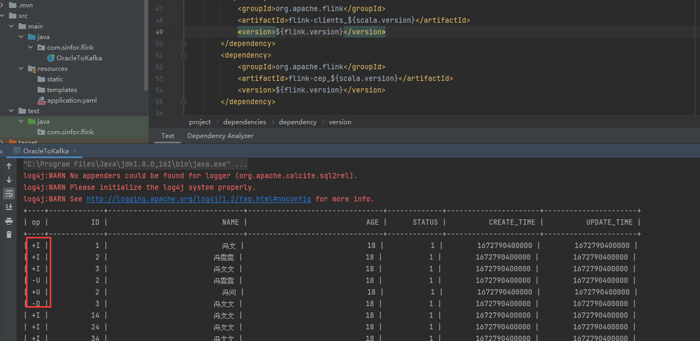

# Flink-CDC同步Oracle全量+增量数据

各资源版本

| 依赖  | 版本  |
|---------|------------|
|  Oracle | Oracle11g  |
|  Flink-CDC | 2.2.1 |
|  Flink |  1.13.0|
|   JDK |   8|

## Docker安装Oracle11g
准备工作，由于我这边用来搭建demo的机器就一台，且资源有限，选用了docker安装oracle11g，linux、windows的安装过于复杂。
磁盘空间有限，先清空了一些磁盘空间（oracle需6个G的磁盘）。

清空docker overlay2、container的磁盘
container里面主要是一些日志，占用了很大的磁盘空间，可以根据container的md5直接查看到是具体那个容器使用的，如果不需要直接停止删除掉容器即可。

1.安装oracle11g，安装时间大概需要几分钟到十分钟。
```shell
docker pull registry.cn-hangzhou.aliyuncs.com/helowin/oracle_11g
```

2.启动oracle11g
```shell
docker run -d -p 1521:1521 --name oracle11g registry.cn-hangzhou.aliyuncs.com/helowin/oracle_11g
```

3.进入oracle容器
```shell
docker exec -it oracle11g bash
```

## Oracle操作
1.进入oracle容器后，切换root用户
```shell
su root 
# 输入密码：helowin
```

2.编辑profile文件配置ORACLE环境变量
```shell
vi /etc/profile
# 在文件最后写上下面内容
export ORACLE_HOME=/home/oracle/app/oracle/product/11.2.0/dbhome_2
export ORACLE_SID=helowin
export PATH=$ORACLE_HOME/bin:$PATH

# 保存后source /etc/profile
```

3.创建软链
```shell
ln -s $ORACLE_HOME/bin/sqlplus /usr/bin
```

4.切换回oracle用户
```shell
su - oracle

# 新建数据目录
mkdir /home/oracle/oracle-data

# 登录sqlplus
sqlplus /nolog
# 使用dba权限
SQL> conn /as sysdba

```

5.oracle具体操作，归档、添加补充日志、创建用户等
```shell
# 开启日志归档
SQL> alter system set db_recovery_file_dest_size = 5G;
SQL> alter system set db_recovery_file_dest = '/home/oracle/oracle-data' scope=spfile;
SQL> shutdown immediate;
SQL> startup mount;
SQL> alter database archivelog;
SQL> alter database open;

# 查看日志归档是否开启
SQL> archive log list;

# 开启补全日志
SQL> ALTER DATABASE ADD SUPPLEMENTAL LOG DATA;
# 查看是否开启补全日志
SQL> select supplemental_log_data_min min from v$database;

# 创建表空间
CREATE TABLESPACE sinfor DATAFILE '/home/oracle/sinfor.dbf' SIZE 25M REUSE AUTOEXTEND ON MAXSIZE UNLIMITED;

# 创建用户
CREATE USER sinfor IDENTIFIED BY sinfor DEFAULT TABLESPACE SINFOR;

# 给用户授权
grant connect,resource,dba to sinfor;
```

6.使用DBeaver连接数据库并建表,服务名/SID是helowin，用户名密码为刚建的用户
```sql
CREATE TABLE "SINFOR"."sinfor_user" 
   (	
    "ID" VARCHAR2(20), 
	"NAME" VARCHAR2(100), 
	"AGE" NUMBER(3,0), 
	"STATUS" NUMBER(1,0), 
	"CREATE_TIME" DATE, 
	"UPDATE_TIME" DATE, 
	 PRIMARY KEY ("ID")
   )
```



7.要同步的表也加上补全日志
```shell
alter table "sinfor_user" ADD SUPPLEMENTAL LOG DATA (ALL) COLUMNS;

# 查看所有补全日志
select * from dba_log_groups;
```

### 程序开发

maven依赖
```xml
<?xml version="1.0" encoding="UTF-8"?>
<project xmlns="http://maven.apache.org/POM/4.0.0" xmlns:xsi="http://www.w3.org/2001/XMLSchema-instance"
         xsi:schemaLocation="http://maven.apache.org/POM/4.0.0 https://maven.apache.org/xsd/maven-4.0.0.xsd">
    <modelVersion>4.0.0</modelVersion>
    <groupId>com.sinfor</groupId>
    <artifactId>sinfor-flink</artifactId>
    <version>0.0.1-SNAPSHOT</version>

    <properties>
        <java.version>1.8</java.version>
        <maven.compiler.source>${java.version}</maven.compiler.source>
        <maven.compiler.target>${java.version}</maven.compiler.target>
        <flink.version>1.13.0</flink.version>
        <scala.version>2.12</scala.version>
    </properties>
    <dependencies>
        <dependency>
            <groupId>org.apache.flink</groupId>
            <artifactId>flink-table-planner-blink_${scala.version}</artifactId>
            <version>${flink.version}</version>
        </dependency>

        <dependency>
            <groupId>com.ververica</groupId>
            <artifactId>flink-connector-oracle-cdc</artifactId>
            <version>2.2.1</version>
        </dependency>
        <dependency>
            <groupId>org.apache.flink</groupId>
            <artifactId>flink-connector-kafka_2.11</artifactId>
            <version>1.13.6</version>
        </dependency>

        <dependency>
            <groupId>com.oracle</groupId>
            <artifactId>ojdbc6</artifactId>
            <version>11.2.0.3</version>
        </dependency>
        <dependency>
            <groupId>org.apache.flink</groupId>
            <artifactId>flink-streaming-java_${scala.version}</artifactId>
            <version>${flink.version}</version>
        </dependency>

        <dependency>
            <groupId>org.apache.flink</groupId>
            <artifactId>flink-clients_${scala.version}</artifactId>
            <version>${flink.version}</version>
        </dependency>
        <dependency>
            <groupId>org.apache.flink</groupId>
            <artifactId>flink-cep_${scala.version}</artifactId>
            <version>${flink.version}</version>
        </dependency>

        <dependency>
            <groupId>org.apache.flink</groupId>
            <artifactId>flink-java</artifactId>
            <version>${flink.version}</version>
        </dependency>
        <dependency>
            <groupId>org.apache.flink</groupId>
            <artifactId>flink-json</artifactId>
            <version>${flink.version}</version>
        </dependency>
        <dependency>
            <groupId>com.alibaba</groupId>
            <artifactId>fastjson</artifactId>
            <version>1.2.68</version>
        </dependency>

        <dependency>
            <groupId>org.projectlombok</groupId>
            <artifactId>lombok</artifactId>
            <version>1.18.20</version>
        </dependency>
        <!--Flink 默认使用的是 slf4j 记录日志，相当于一个日志的接口,我们这里使用 log4j 作为
       具体的日志实现-->
        <dependency>
            <groupId>org.slf4j</groupId>
            <artifactId>slf4j-api</artifactId>
            <version>1.7.25</version>
        </dependency>
        <dependency>
            <groupId>org.slf4j</groupId>
            <artifactId>slf4j-log4j12</artifactId>
            <version>1.7.25</version>
        </dependency>
        <dependency>
            <groupId>org.apache.logging.log4j</groupId>
            <artifactId>log4j-to-slf4j</artifactId>
            <version>2.14.0</version>
        </dependency>
    </dependencies>

    <build>
        <plugins>
            <plugin>
                <groupId>org.apache.maven.plugins</groupId>
                <artifactId>maven-assembly-plugin</artifactId>
                <version>3.0.0</version>
                <configuration>
                    <descriptorRefs>
                        <descriptorRef>jar-with-dependencies</descriptorRef>
                    </descriptorRefs>
                </configuration>
                <executions>
                    <execution>
                        <id>make-assembly</id>
                        <phase>package</phase>
                        <goals>
                            <goal>single</goal>
                        </goals>
                    </execution>
                </executions>
            </plugin>
        </plugins>
    </build>
</project>
```

用单表的方式，但是这种方式有局限性，需要每张表都作为一个任务占用slot资源。且tableApi我好像没发现有sink功能。
```java
package com.sinfor.flink;

import org.apache.flink.streaming.api.environment.StreamExecutionEnvironment;
import org.apache.flink.table.api.TableResult;
import org.apache.flink.table.api.bridge.java.StreamTableEnvironment;

/**
 * @author fengwen
 * @date 2023/4/12
 * @description TODO
 **/
public class OracleToKafka {

    public static void main(String[] args) throws Exception {
        StreamExecutionEnvironment env = StreamExecutionEnvironment.getExecutionEnvironment();
        StreamTableEnvironment tableEnv = StreamTableEnvironment.create(env);
        env.setParallelism(1);
        env.disableOperatorChaining();

        tableEnv.executeSql("CREATE TABLE sinfor_user (\n" +
                "     `ID` INT NOT NULL,\n" +                   // 注意字段名要大写
                "     `NAME` STRING,\n" +
                "     `AGE` STRING,\n" +
                "     `STATUS` INT,\n" +
                "     `CREATE_TIME` BIGINT,\n" +
                "     `UPDATE_TIME` BIGINT,\n" +
                "     PRIMARY KEY(`ID`) NOT ENFORCED\n" +   // 要加上NOT ENFORCED
                "     ) WITH (\n" +
                "     'connector' = 'oracle-cdc',\n" +
                "     'hostname' = 'xx.xx.xx.xx',\n" +
                "     'port' = '1521',\n" +
                "     'username' = 'sinfor',\n" +
                "     'password' = 'sinfor',\n" +
                "     'database-name' = 'helowin',\n" +         // 服务名/SID
                "     'schema-name' = 'SINFOR',\n" +           // 注意这里要大写
                "     'table-name' = 'SINFOR_USER',\n" +
                "     'debezium.log.mining.continuous.mine'='true',\n"+
                "     'debezium.log.mining.strategy'='online_catalog',\n" +
                "     'debezium.database.tablename.case.insensitive'='false',\n"+
                "     'scan.startup.mode' = 'initial')");
        TableResult tableResult = tableEnv.executeSql("select * from sinfor_user");
        tableResult.print();


        env.execute();
    }
}

```

用DataStream方式,这种方式坑有点多，实属不易。但是好在测试是成功的，也能sink到kafka
```java
package com.sinfor.flink;

import com.ververica.cdc.connectors.oracle.OracleSource;
import com.ververica.cdc.connectors.oracle.table.StartupOptions;
import com.ververica.cdc.debezium.JsonDebeziumDeserializationSchema;
import org.apache.commons.lang3.StringUtils;
import org.apache.flink.api.common.serialization.SimpleStringSchema;
import org.apache.flink.streaming.api.datastream.DataStreamSource;
import org.apache.flink.streaming.api.datastream.SingleOutputStreamOperator;
import org.apache.flink.streaming.api.environment.StreamExecutionEnvironment;
import org.apache.flink.streaming.api.functions.source.SourceFunction;
import org.apache.flink.streaming.connectors.kafka.FlinkKafkaProducer;

import java.util.Properties;

/**
 * @author fengwen
 * @date 2023/4/17
 * @description TODO
 **/
public class Oracle2Kafka {

    public static void main(String[] args) throws Exception {

        Properties properties = new Properties();
        properties.setProperty("debezium.database.tablename.case.insensitive", "false");
        properties.setProperty("debezium.log.mining.strategy", "online_catalog");
        properties.setProperty("debezium.log.mining.continuous.mine", "true");
        SourceFunction<String> sourceFunction = OracleSource.<String>builder()
                .hostname("xxx.xx.xx.xxx")
                .port(1521)
                .database("helowin") // monitor XE database
                .schemaList("SINFOR") // monitor inventory schema
                .tableList("SINFOR.SINFOR_USER") // monitor products table
                .username("sinfor")
                .password("sinfor")
                .startupOptions(StartupOptions.initial())
                .debeziumProperties(properties)
                .deserializer(new JsonDebeziumDeserializationSchema()) // converts SourceRecord to JSON String
                .build();
        StreamExecutionEnvironment env = StreamExecutionEnvironment.getExecutionEnvironment();
        DataStreamSource<String> sourceStream = env.addSource(sourceFunction).setParallelism(1);// use parallelism 1 for sink to keep message ordering
        SingleOutputStreamOperator<String> streamOperator = sourceStream
                .filter(StringUtils::isNotEmpty);
        streamOperator.setParallelism(1).print();
        //sink到kafka
        Properties kafkaProp = new Properties();
        kafkaProp.setProperty("bootstrap.servers", "xxx.xx.xx.xxx:9191");
        FlinkKafkaProducer<String> producer = new FlinkKafkaProducer<>("sinfor",
                new SimpleStringSchema(),
                kafkaProp);
        streamOperator.addSink(producer);
        env.execute();
    }
}

```

测试结果如下，全量及后续的改和删都能正常


::: warning
1.这里面或多或少会有坑在，因为flink-cdc版本一定要选2.1.0后，flink-cdc和flink的版本是有对应关系的。
同时如果包下载不了的话需要本地mvn安装下，但是我这个依赖应该都是能正常下载的。

2.oracle里的date类型到flink里是要用BIGINT去接收的。

3.一定要开启同步表的补全日志，不然会报错提示要你去执行ADD SUPPLEMENTAL LOG DATA (ALL) COLUMNS之类

4.找不到XXFactory，这个错误是依赖不对。

5.如果表名是user，user是关键字，要用``括起来，不过一般应该没人这么命名表吧...

6.数据更新延迟问题，要设置下面两个参数
'debezium.log.mining.strategy'='online_catalog',
'debezium.log.mining.continuous.mine'='true'

7.并行度只能为1
:::

mvn 安装本地jar包相关命令
```shell
mvn install:install-file -Dfile=.\flink-sql-connector-oracle-cdc-2.1.1.jar -DgroupId=com.ververica -DartifactId=flink-connector-oracle-cdc -Dversion=2.1.1 -Dpackaging=jar
```


oracle日志爆炸问题

```shell
docker exec -it oracle11g bash
source /etc/profile
sqlplus /nolog
connect /as sysdba

# 查看日志大小
select * from V$FLASH_RECOVERY_AREA_USAGE;
# 查看archive存放位置
show parameter recover;

exit
rman target sys/pass
# 检查无用的archive
crosscheck archivelog all;
删除截止到前一天的所有archivelog：
delete archivelog until time 'sysdate-1';
delete archivelog until time 'sysdate';
```