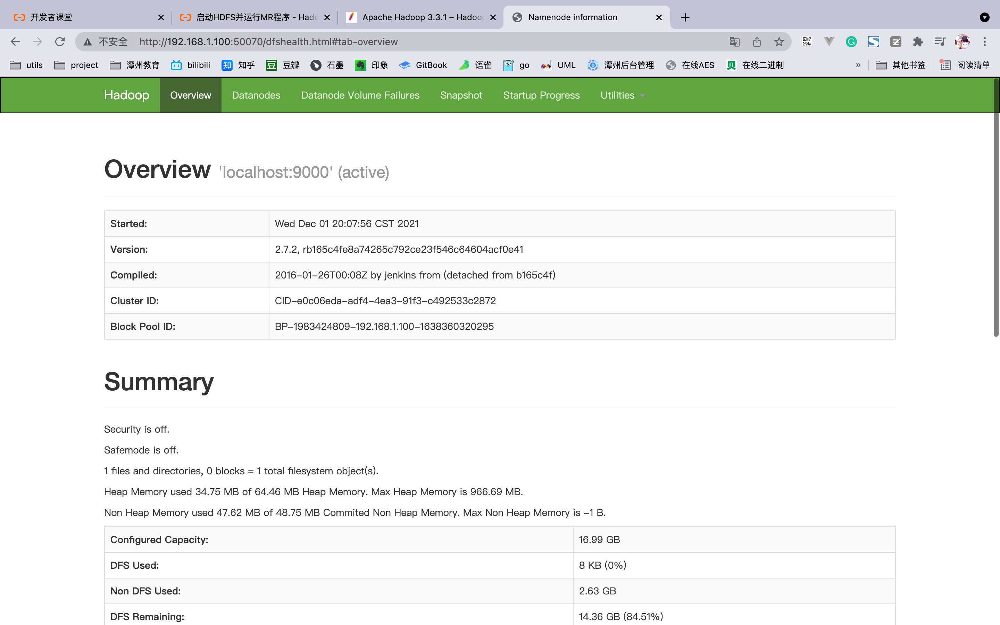

# Hadoop

## 安装

[官网地址](https://www.apache.org/dyn/closer.cgi/hadoop/common/hadoop-3.3.5/hadoop-3.3.5.tar.gz)

```shell
wget https://dlcdn.apache.org/hadoop/common/hadoop-3.3.5/hadoop-3.3.5.tar.gz
```

```shell
tar zxvf hadoop-3.3.5.tar.gz
```

## 配置

在 etc/core-site.xml

```shell
<configuration>
 <property>
   <name>fs.defaultFS</name>
   <value>hdfs://localhost:9000</value>
 </property>

 <property>
   <name>hadoop.tmp.dir</name>
   <value>/home/software/hadoop-3.3.5/data</value>
 </property>
</configuration>
```

修改 etc/hdfs-site.xml

```shell
<configuration>
 <property>
  <name>dfs.replication</name>
  <value>1</value>
 </property>
</configuration>
```

```shell
<property>
    <name>dfs.namenode.name.dir</name>
    <value>/home/hadoop-twq/bigdata/dfs/name</value>
    <description>表示 NameNode 需要存储数据的文件目录</description>
</property>
<property>
    <name>dfs.datanode.data.dir</name>
    <value>/home/hadoop-twq/bigdata/dfs/data</value>
    <description>表示 DataNode 需要存放数据的文件目录</description>
</property>
```


 修改hadoop-env.sh的javahome为配置的java_home


 格式化hdfs
 ```shell
/bin/hdfs namenode -format
 ```

 启动namenode和datanode
 ```shell
 /sbin/hadoop-daemons.sh start namenode
 /sbin/hadoop-daemons.sh start datanode
 ```

 在50070端口查看hadoop主页

