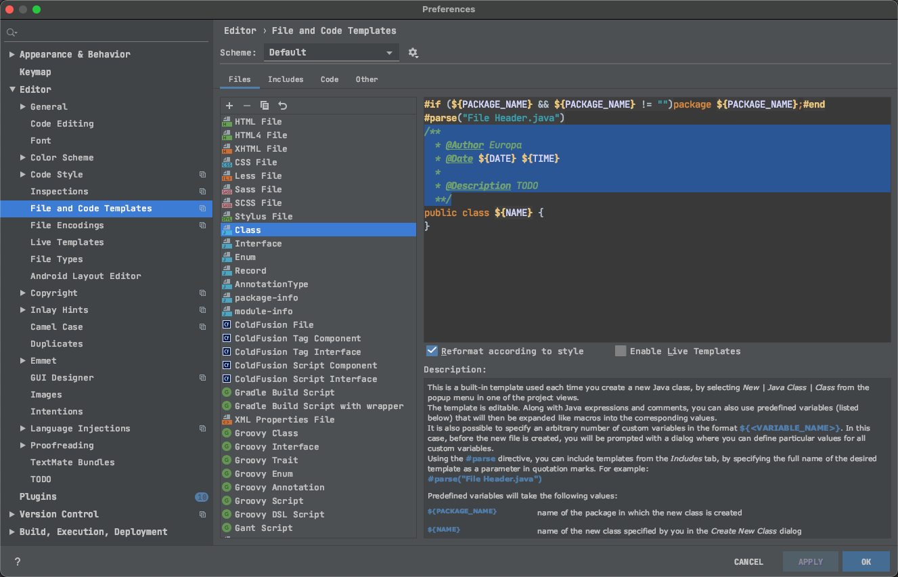
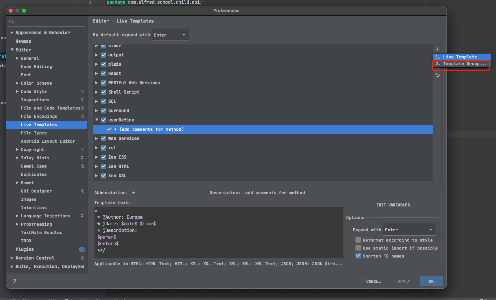

# Intelij一些设置

## 注释模版

### 类注释模版

> 创建新类的时候自动生成注释

```java
/**
  * @Author Europa
  * @Date ${DATE} ${TIME}
  *
  * @Description TODO
  **/
```



### 方法注释模版

* 新建模版组
* 新建模版 并命名为*
* 将模版expand with改为enter（左上角或右下角）
* 添加template text
* 修改 variables
* date设为date()
* time不管
* param和return的表达式设为下面两个脚本，顺序对应

```java
*
 * @Author: Europa 
 * @Date: $date$ $time$
 * @Description:
 $param$
 $return$
 **/
```

```groovy
groovyScript("if(\"${_1}\".length() == 2) {return '';} else {def result=''; def params=\"${_1}\".replaceAll('[\\\\[|\\\\]|\\\\s]', '').split(',').toList();for(i = 0; i < params.size(); i++) {if(i==0){result+='* @param ' + params[i] + ': '}else{result+='\\n' + ' * @param ' + params[i] + ': '}}; return result;}", methodParameters()); 


groovyScript("def returnType = \"${_1}\"; def result = '* @return: ' + returnType; return result;", methodReturnType()); 
```

