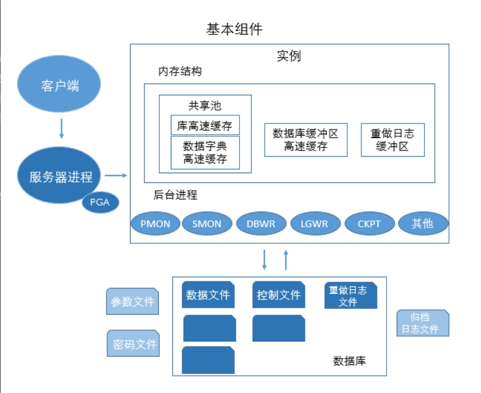
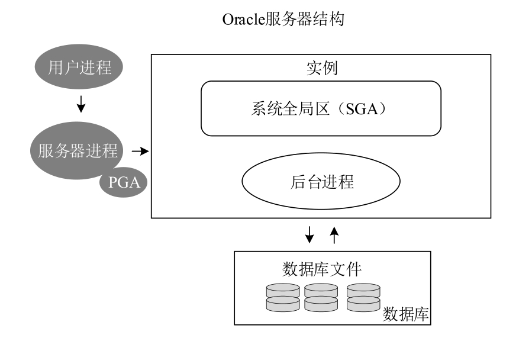
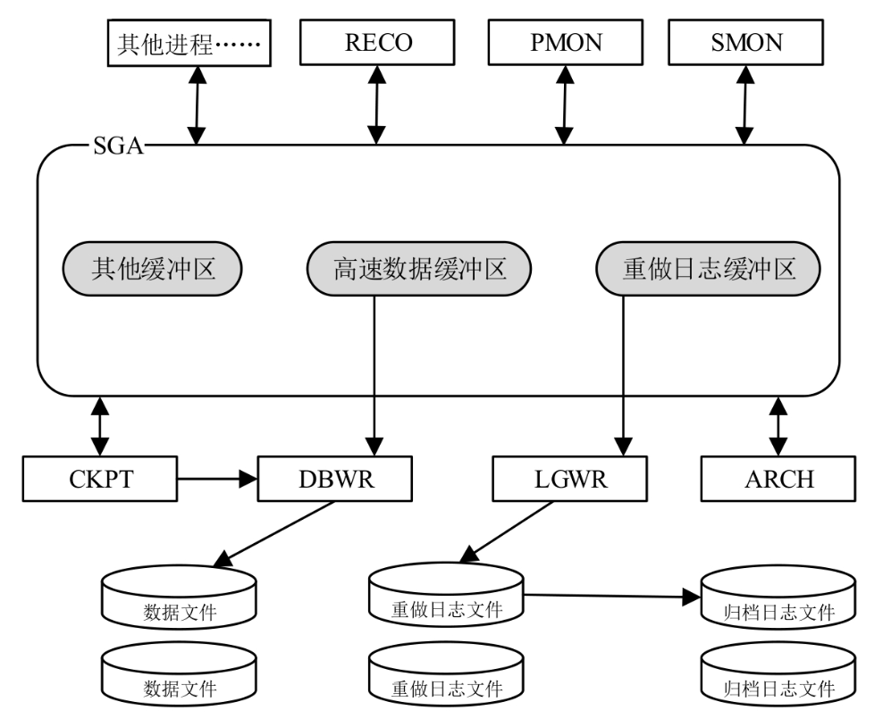
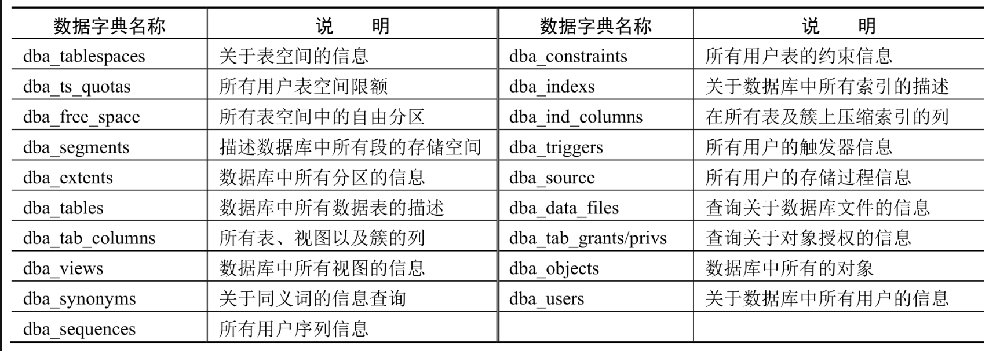
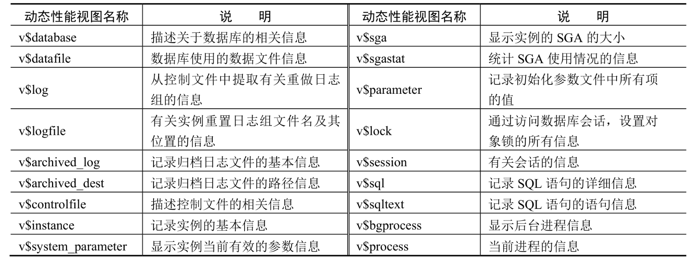
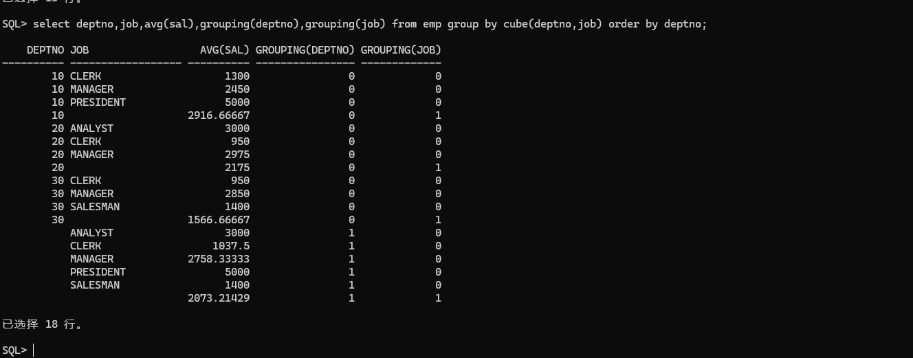
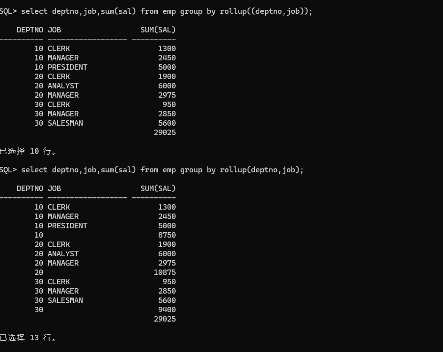

# Oracle

这两年接触Oracle的频率越来越高了，有些基础知识记录一下。

## 1. 体系结构

* 逻辑存储结构
  * 数据块
  * 数据区
  * 段
  * 表空间
* 物理存储结构
  * 数据文件
  * 控制文件
  * 日志文件
  * 服务器参数文件
  * 密码文件、警告文件、跟踪文件
* 服务器结构
  * 系统全局区
  * 程序全局区
  * 前台进程
  * 后台进程
* 数据字典



### 1.1 逻辑存储结构

#### 1.1.1 数据块
逻辑结构中最小单元，同时也是数据库输入/输出操作的最小存储单位。总是操作系统块的整数倍。操作系统2048 B，oracle 8192 B
```sql
SQL> col name format a30
SQL> col value format a20
SQL> select name,value from v$parameter where name = 'db_block_size' ;
```

> 块头：数据块基本信息，如物理地址、所属段的类型。
> 表目录：若存的数据是表数据，则存储表相关信息。
> 行目录：若存行数据，则行信息会被记录。
> 空余：未使用区域，用于新插入和已经存在行的更新。
> 行数据：存放表数据和索引数据。已被数据行占用。


#### 1.1.2 数据区
一组连续的数据块组成，当一个段中所有空间被用完，会自动分配一个新区。

#### 1.3 段
一个或多个数据区构成，不是存储空间分配单位，而是逻辑结构，属于数据对象。每建立一个数据对象（表、索引）时，为其创建一个段。包含的数据区可以不连续。

> 数据段：保存表中记录，创建表时，oracle为表创建数据段，当数据量增大，数据段亦通过增加数据区方式增大。
> 索引段：建立索引时，建立索引段，名称同名。
> 回滚段：保存回滚条目，撤销未提交的操作，当开始一个事务时，oracle为其分配回滚段。
> 临时段：临时存储空间。

#### 1.4 表空间
oracle使用表空间将相关的逻辑结构（段、数据区）等组合在一起，是最大的逻辑划分单元，用来存放如数据表、索引、回滚段等数据对象。任何数据对象创建时必须指定存储在某个表空间中。  
表空间与物理数据文件对应，一个表空间由一个或多个数据文件组成。

默认表空间
> SYSTEM：系统内部表，数据字典的数据，如表名、列名、用户名等。
> SYSAUX：SYSTEM的辅助表空间，降低SYSTEM负荷。主要为除数据字典外的其他数据对象。
> UNDO：在修改删除时，oracle自动将变更前数据临时存储在撤销表空间。在commit之后，根据系统设置的保留时间来释放掉这部分空间。
> USERS：建议用户使用的表空间，样例用户scott就使用的该空间。

用户应根据实际情况创建自定义表空间，以区分用户数据和系统数据，同时存储在不同磁盘上，减少IO冲突。

### 1.2 物理存储结构

#### 1.2.1 数据文件
在创建表空间时，oracle会创建对应的数据文件。一个表空间有一个或多个数据文件，具体如何存储由oracle决定。  
数据读取时，oracle从数据文件中读取入高速缓冲区，再次读取时则优先走高速缓冲区。在修改和写入时，将数据保存在数据缓冲区，具体由DBWR进程决定何时写入数据文件。减少磁盘IO。

```sql
SQL> col file_name for a50;
SQL> set linesize 100;
SQL> select file_name,tablespace_name from dba_data_files;
```
> 系统数据文件
> 撤销数据文件
> 用户数据文件

其实和表空间基本对应。

#### 1.2.2 控制文件
控制文件记录了数据库的物理结构，如数据库名、数据文件和日志文件的名字和位置、数据库建立时间等。  
所以启动实例时，oracle会打开该文件，正常后才会加载并打开数据库。

```sql
SQL> col name format a60;
SQL> select name from v$controlfile;
```

>当Oracle实例正常启动时，系统首先要访问的是初始化参数文件SPFILE；然后Oracle为系统全局区(SGA)分配内存，这时Oracle实例处于安装状态，并且控制文件处于打开状态；接下来Oracle会自动读出控制文件中的所有数据文件和日志文件的信息，并打开当前数据库中所有的数据文件和所有的日志文件以供用户访问。

#### 1.2.3 日志文件
对数据所作修改，数据库所作修改几乎都会记录到日志文件中。在出问题时，可有通过日志文件得到原始数据。

* **重做日志文件(redo log file)**  
所有的修改、增加、删除等更改信息，以及创建表、索引等变化。都会被记录到redo log中。用户commit时，会先将原始数据写入日志，日志写入成功后，才会将新记录传递至之后流程。

```sql
SQL> col member for a50;
SQL> select member from v$logfile;
```
> oracle在运行中产生的日志，会先被临时存在SGA（系统全局区）的重做日志缓冲区中，当用户commit或缓冲区满1/3时，日志写入进程LGWR将日志从缓冲区读出，然后将其写入日志文件组中序列较小的文件内，在一个日志组被写满后，接着写入第二个组，然后到最后一个组写满后重复该操作写第一个日志组。

> 为保证数据库系统安全性，oracle实例会使用一个日志线程来记录数据库变化。日志线程由若干个“日志组”构成，每个日志组由一个或多个日志文件构成。

* **归档日志文件(archive log file)**
对于上述设计，回到第一个日志组覆写日志，则会将一部分较早日志覆盖。因此可有设置为归档模式运行oracle。在所有日志组被写满后，归档模式中会由ARCH归档进程将日志读取后写入归档日志中。
LGWR进程需等待ARCH进程结束后才能开始覆写日志，所以会影响性能。所以默认情况下不会使用归档模式启动。

```sql
# 查询启动模式
SQL> col name format a30;
SQL> select dbid,name,log_mode from v$database;
```

```sql
# 查询归档日志所在路径
SQL> set pagesize 30;
SQL> show parameter log_archive_dest;
```

#### 1.2.4 服务器参数文件
记录oracle的基本信息（数据库名、控制文件路径、日志缓冲大小log_buffer等）。在实例启动之前，oracle会首先读取SPFILE中设置的这些参数，然后根据这些初始化参数来配置和启动实例。
该文件最好不能直接编辑，而是由oracle自己维护，最好通过OEM企业管理器或者alter system命令修改，改完后会自动写入到SPFILE中。

```sql
SQL> col name for a30;
SQL> col value for a30;
SQL> select name,value,ismodified from v$parameter;
```
```sql
# 显示服务器参数
show parameter;
```

#### 1.2.5 密码文件、警告文件、跟踪文件
>密码文件是Oracle系统用于验证sysdba权限的二进制文件，当远程用户以sysdba或sysoper连接到数据库时，一般要用密码文件验证。
默认存储位置在%dbhome_1%\database目录下，命名格式为PWD<sid>，其中sid表示数据库实例名。

```sql
C:\>ORAPWD FILE=<filename> PASSWORD=<password> ENTRIES=<max_users>
```


> 警告文件alert_orcl.log是oracle日常运行中的日志。包括实例启动、关闭，建立空间、错误信息等。最好定期删除。

```sql
SQL> SELECT value FROM v$diag_info WHERE name = 'Diag Trace';
```

> 跟踪文件包括后台进程跟踪orcl_cjq0_xxx.trc和用户进程跟踪orcl_ora_xxx.trc。后台进程记录后台进程的警告或错误消息。用户进程用于记载用户相关的信息，主要跟踪sql语句。通过该文件，可以判断sql执行性能。

```sql
SQL> select value from v$parameter where name = 'user_dump_dest';
```

### 1.3 服务器结构



#### 1.3.1 系统全局区（SGA）
所有用户进程共享的一块内存区域。数据库实例启动时加载内存。实例关闭则关闭。

**高速数据缓冲区**
> 查询时，会先走高速缓冲区查询数据，若无，再打开数据文件。

* 脏数据区：已经被修改过的数据，等待被写入数据文件。commit后BGWR进程写入。
* 空闲区：待写入。
* 保留区：缓存区。

**重做日志缓冲区**
修改数据时，先会写入重做日志缓冲区，然后由LGWR进程将其写入重做日志文件中。

重做日志大小由log_buffer参数指定。通常较大的日志缓冲区能减少磁盘io，提升性能。该参数支持动态修改。

**共享池**
SGA保留区域，用于缓存sql语句、数据字典、资源锁等。
* 库高速缓冲区
>主要包含共享sql和私有sql两个区，存储最近的sql语句、执行计划等。执行相同sql时能直接获取执行计划，无需再解析。私有区存变量等。
* 字典高速缓冲区
> 字典高速缓冲区用于存储Oracle系统内部管理所需要的数据字典信息，如用户名、数据对象和权限等

```sql
SQL> alter system set shared_pool_size=30m;
```

**大型池**
>大型池在SGA区中不是必需的内存结构，只有在某些特殊情况下，实例才需要使用大型池来减轻共享池的访问压力，常用的情况有以下几种。 当使用恢复管理器进行备份和恢复操作时，大型池将作为I/O缓冲区使用。 当使用I/O Slave仿真异步I/O功能时，大型池将被当作I/O缓冲区使用。 执行具有大量排序操作的SQL语句。当使用并行查询时，大型池将作为并行查询进程彼此交换信息的地方。

```sql
SQL> alter system set large_pool_size = 16m;
SQL> show parameter large_pool_size;
```

**Java池**
>Java池用来提供内存空间给Java虚拟机使用，目的是支持在数据库中运行Java程序包，其大小由java_pool_size参数决定。

**Oracle流池**
>Oracle流池用于在数据库与数据库之间进行信息共享。如果没有用到Oracle流，就不需要设置该池。Oracle流池的大小由参数streams_pool_size决定。

#### 1.3.2 程序全局区（PGA）
>又称作用户进程全局区，它的内存区在进程私有区中，而不是在共享区中。PGA是一个全局区，可以把代码、全局变量和数据结构都存储在其中，但区域内的资源并不像SGA一样可被所有的用户进程所共享，而是每个Oracle服务器进程都只拥有属于自己的那部分PGA资源。在程序全局区中，一个服务进程只能访问属于它自己的那部分PGA资源区，各个服务进程的PGA的总和即为实例的PGA的大小。通常PGA由私有SQL区和会话区组成。

**私有SQL区**
>私有SQL区用于存储变量以及SQL语句运行时的内存结构信息，每个用户连接到实例时，都会在实例中创建一个会话。这些会话可能会在SGA区中创建一个共享SQL区，但在PGA区中可能会创建多个私有SQL区。把一个私有SQL区与对应的共享SQL区合并在一起，就可以获得一条SQL语句的完整缓存数据。
另外，每个会话的私有SQL区都可以再分为静态区和动态区两部分。静态区的信息在会话过程中保持不变，只有当会话结束时，静态区才会被释放；而动态区的信息在整个会话过程中是不断变化的，一旦SQL语句执行完毕，即使会话还没有结束，动态区也会被释放。

**会话区**
>会话区用于存储用户的会话信息（如登录用户名）。如果数据库处于共享服务器连接模式下，则会话区将位于SGA中，而不是PGA中，用户特别需要注意这一点。

```sql
SQL> show parameter pga;
```
#### 1.3.3 前台进程

**用户进程**
>用户进程是指那些能够产生或执行SQL语句的应用程序，无论是SQL*Plus，还是其他应用程序，只要是能生成或执行SQL语句，都被称作用户进程。在用户进程中有两个非常重要的概念，即连接和会话。连接是一个用户进程与实例之间建立的通信渠道，这个渠道可以通过操作系统上的相关通信机制或网络连接来实现；会话是指在用户进程与实例之间建立连接后形成的用户与实例之间的交互方式，一般是用户发出请求，数据库实例为用户返回响应消息的方式。例如，用户在SQL*Plus中发出connect system/1qaz2wsx的请求命令，若用户名和密码都正确，则数据库实例将返回“已连接”的响应消息。


**服务器进程**
>服务器进程是用于处理用户会话过程中向数据库实例发出的SQL语句或SQL*Plus命令，它可以分为专用服务器模式和共享服务器模式。在专用服务器模式下，每个用户进程都有一个专用的服务器进程，这个服务器进程代表用户进程执行SQL语句，必要时还可以回传执行结果给用户进程；在共享服务器模式下，每个用户进程不直接与服务器进程连接，而是连接到分派程序，每个分派程序可以同时连接多个用户进程。

#### 1.3.4 后台进程



>实例的重要组成部分。这组后台进程有若干个，如图2.16所示。其中SMON、PMON、DBWR、LGWR和CKPT这5个后台进程必须正常启动，否则将导致数据库实例崩溃。此外，还有很多辅助进程，用于实现相关的辅助功能，如果这些辅助进程发生问题，仅使某些功能受到影响，一般不会导致数据库实例崩溃。下面对其中的主要进程进行讲

**数据写入进程（DBWR）**
将高速缓冲区中修改过的数据写到数据文件。写入时机：
* 高速缓冲区中无空闲数据块可写入修改的新数据。
* 检查点进程启动后，会强制要求DBWR将某些数据块写入数据文件。
* 当修改过的脏数据块在高速缓冲区中存储超过3s时，会自行将其写入。

**检查点进程（CKPT）**
可以看作一个事件，当其发生时，CKPT会要求DBWR将某些脏数据块写入数据文件。用户操作数据时，会产生大量重做日志，日志进程将日志写入文件组中，当发生日志切换时（从一个组到另一个组），就会启动CKPT。

**日志写入进程（LGWR）**
oracle运行时的重做日志会先被记录在SGA的重做日志缓冲区，当commit或缓冲区满1/3或日志存储超过3s时，LGWR会将其读取并写入文件组中序号较小的文件。

**归档进程（ARCH）**
可选进程，只有归档模式下会起作用，在各日志组被写满，即将被覆盖前。ARCH会将即将被覆盖的日志读出写入到归档日志中。

**系统监控进程（SMON）**


**进程监控进程（PMON）**


#### 1.3.5 数据字典
oracle存储数据内部信息的地方，描述了内部的运行和管理情况。
由前缀和后缀组成，下划线_连接。

* dba_：数据库实例的所有对象信息。
* v$_: 当前实例的动态视图，系统管理和系统优化方面。内存和磁盘情况。
* user_: 记录用户的对象信息。
* gv_: 分布式环境下所有实例的动态视图。
* all_: 记录用户的对象信息及被授权访问的对象信息。






## 2.管理工具

### 2.1 SQL Plus
```sql
SQLPLUS username[/password][@connect_identifier] [AS SYSOPER|SYSDBA]
```

```sql
sqlplus /as sysdba
create user scott identified by tiger;

ALTER USER scott DEFAULT TABLESPACE USERS;
ALTER USER scott TEMPORARY TABLESPACE TEMP;

GRANT dba TO scott;
CONNECT scott/tiger;
```

```sql
-- 创建数据表
CREATE TABLE dept (
deptno    NUMBER(2) CONSTRAINT PK_DEPT PRIMARY KEY,
dname    VARCHAR2(14) ,
loc        VARCHAR2(13)
) ;
CREATE TABLE emp (
empno    NUMBER(4) CONSTRAINT PK_EMP PRIMARY KEY,
ename    VARCHAR2(10),
job        VARCHAR2(9),
mgr        NUMBER(4),
hiredate    DATE,
sal        NUMBER(7,2),
comm    NUMBER(7,2),
deptno    NUMBER(2) CONSTRAINT FK_DEPTNO REFERENCES DEPT
);
CREATE TABLE bonus (
enamE    VARCHAR2(10)    ,
job        VARCHAR2(9)  ,
sal        NUMBER,
comm    NUMBER
) ;
CREATE TABLE salgrade (
grade        NUMBER,
losal        NUMBER,
hisal        NUMBER
);
-- 插入测试数据 —— dept
INSERT INTO dept VALUES    (10,'ACCOUNTING','NEW YORK');
INSERT INTO dept VALUES (20,'RESEARCH','DALLAS');
INSERT INTO dept VALUES    (30,'SALES','CHICAGO');
INSERT INTO dept VALUES    (40,'OPERATIONS','BOSTON');
-- 插入测试数据 —— emp
INSERT INTO emp VALUES (7369,'SMITH','CLERK',7902,to_date('17-12-1980','dd-mm-yyyy'),800,NULL,20);
INSERT INTO emp VALUES (7499,'ALLEN','SALESMAN',7698,to_date('20-2-1981','dd-mm-yyyy'),1600,300,30);
INSERT INTO emp VALUES (7521,'WARD','SALESMAN',7698,to_date('22-2-1981','dd-mm-yyyy'),1250,500,30);
INSERT INTO emp VALUES (7566,'JONES','MANAGER',7839,to_date('2-4-1981','dd-mm-yyyy'),2975,NULL,20);
INSERT INTO emp VALUES (7654,'MARTIN','SALESMAN',7698,to_date('28-9-1981','dd-mm-yyyy'),1250,1400,30);
INSERT INTO emp VALUES (7698,'BLAKE','MANAGER',7839,to_date('1-5-1981','dd-mm-yyyy'),2850,NULL,30);
INSERT INTO emp VALUES (7782,'CLARK','MANAGER',7839,to_date('9-6-1981','dd-mm-yyyy'),2450,NULL,10);
INSERT INTO emp VALUES (7788,'SCOTT','ANALYST',7566,to_date('13-07-87','dd-mm-yyyy')-85,3000,NULL,20);
INSERT INTO emp VALUES (7839,'KING','PRESIDENT',NULL,to_date('17-11-1981','dd-mm-yyyy'),5000,NULL,10);
INSERT INTO emp VALUES (7844,'TURNER','SALESMAN',7698,to_date('8-9-1981','dd-mm-yyyy'),1500,0,30);
INSERT INTO emp VALUES (7876,'ADAMS','CLERK',7788,to_date('13-07-87','dd-mm-yyyy')-51,1100,NULL,20);
INSERT INTO emp VALUES (7900,'JAMES','CLERK',7698,to_date('3-12-1981','dd-mm-yyyy'),950,NULL,30);
INSERT INTO emp VALUES (7902,'FORD','ANALYST',7566,to_date('3-12-1981','dd-mm-yyyy'),3000,NULL,20);
INSERT INTO emp VALUES (7934,'MILLER','CLERK',7782,to_date('23-1-1982','dd-mm-yyyy'),1300,NULL,10);
-- 插入测试数据 —— salgrade
INSERT INTO salgrade VALUES (1,700,1200);
INSERT INTO salgrade VALUES (2,1201,1400);
INSERT INTO salgrade VALUES (3,1401,2000);
INSERT INTO salgrade VALUES (4,2001,3000);
INSERT INTO salgrade VALUES (5,3001,9999);
-- 事务提交
COMMIT;
```

```sql
select * from dept;
```

### 2.2 SQL Developer

### 2.3 Oracle企业管理器（OEM）
```sql
select dbms_xdb_config.gethttpsport FROM DUAL;
exec DBMS_XDB_CONFIG.SETHTTPSPORT(5500);
select dbms_xdb_config.gethttpsport FROM DUAL;

# 访问，新版网页版只能看性能指标了
https://localhost:5500/em
```

### 2.4 数据库配置助手 （DBCA）


## 3.SQL基础

### 3.1 分类

* 数据查询（DQL）
  select xxx
* 数据操纵（DML）
  insert update delete xxx
* 事物控制（TCL）
  commit rollback savepoint
* 数据定义（DDL）
  create alter drop table...
* 数据控制（DCL）
  grant revoke

### 3.2 用户模式

#### 3.2.1 模式&模式对象
>在Oracle数据库中，为了便于管理用户创建的数据库对象（如数据表、索引、视图等），引入了模式的概念，某个用户创建的数据库对象都属于该用户模式。


> 模式是数据库对象的集合，为一个数据库用户所有，并且具有与该用户相同的名称，如system模式、scott模式等。在一个模式内部不可以直接访问其他模式的数据库对象，即使在具有访问权限的情况下，也需要指定模式名称才可以访问其他模式的数据库对象。模式对象是由用户创建的逻辑结构，用以存储或引用数据。例如，前面章节中所讲过的段（如表、索引等），以及用户所拥有的其他非段的数据库对象。这些非段的数据库对象通常包括约束、视图、同义词、过程以及程序包等。简而言之，模式与模式对象之间的关系就是拥有与被拥有的关系，即模式拥有模式对象，而模式对象被模式所拥有。
#### 3.2.2 检索数据
```sql
SELECT {[ DISTINCT | ALL ] columns | *}
[INTO table_name]
FROM {tables | views | other select}
[WHERE conditions]
[GROUP BY columns]
[HAVING conditions]
[ORDER BY columns]
```

#### 3.2.3 基本语法

**处理null**
```sql
SQL> select ename,sal,comm,sal+comm from emp;
```
如果comm是null, sal+comm也是null，不合理。

```sql
SQL> select ename,sal,comm,sal+nvl(comm,0) from emp;
```

**连接字符串**
```sql
SQL> select ename || ''''||'s job is '||job from emp;
SQL> select concat(concat(ename, '''s salary is '),sal) from emp;
```

**all**
```sql
SQL> select empno,ename,sal from emp where sal <> all(3000,950,800);
```

**转义符**

在like时，会用到%做多个字符的通配符或者_做单个字符的通配符。
如第一个字符是S，第三个字符是L，第五个字符为S
```sql
SQL> select empno,ename,job from emp where job like 'S_L_S%';
```
但是如果字符串含有%或者_，则需使用escape关键字
```sql
SQL> select * from dept_temp where dname like 'IT\_%' escape '\';
```
在上述查询语句中使用了“\”​。​“\”为转义字符，即在“\”之后的“_”字符已不是通配符，而是它本来的含义，即下画线。因此，该查询的结果为：前两个字符为IT，第三个字符为“_”​，后跟任意字符的字符串。

或者使用别的字符作为转义符，下面语句和上面效果一样。
```sql
SQL> select * from dept_temp where dname like 'ITa_%' escape 'a';
```

**分组**

只能用分组列以及聚合函数作为查询投影。
如果在一个查询中使用了分组函数，则任何不在分组函数中的列或表达式必须在GROUPBY子句中。
```sql
SELECT columns_list
FROM table_name
[WHERE conditional_expression]
GROUP BY columns_list
```

>在SELECT子句的后面只可以有两类表达式，即统计函数和进行分组的列名。 SELECT子句中的列名必须是进行分组的列，除此之外，添加其他的列名都是错误的，但是GROUP BY子句后面的列名可以不出现在SELECT子句中。 在默认情况下，将按照GROUP BY子句指定的分组列升序排列，如果需要重新排序，可以使用ORDER BY子句指定新的排列顺序


多列分组：每个部门每种岗位的平均工资和最高工资
```sql
SQL> select deptno,job,avg(sal),max(sal)
  from emp
  group by deptno,job;
```

**having**
>HAVING子句通常与GROUP BY子句一起使用，在完成对分组结果统计后，可以使用HAVING子句对分组的结果做进一步的筛选。
```sql
# 此处用where会报错，除非再包一层。where中不可以使用聚集函数。
select deptno,max(sal) from emp group by deptno having max(sal) > 3000;
```

**小计、总计**
> rollup

会生成横向的小计和总计
```sql
select deptno,job,avg(sal) from emp group by rollup(deptno,job) order by deptno;
```
> cube

除横向小计和总计外，另会生成竖向小计，如上面rollup除部门岗位的分组维度外，另会生成部门维度的小计。
但是cube除了部门岗位的分组维度外，他还会生成部门维度的横向小计以及岗位维度的竖向小计。

```sql
select deptno,job,avg(sal) from emp group by cube(deptno,job) order by deptno;
```

在使用rollup和cube时，可以使用grouping来判断多生成的结果是否使用到了某个列。
```sql
select deptno,job,avg(sal),grouping(deptno),grouping(job) from emp group by cube(deptno,job) order by deptno;
```



> 过滤部分小计。如只想要总计和部门岗位的统计。他也是按类似最左匹配。如group by(a,b,c)和group by(a, (b, c))是不同的结果，前者会生成(a,b,c)和(a,b)、(a)、()的分组结果。但是后者为(a,b,c)、(a)、()的分组结果。如下面查询，只会按部门岗位group by以及总计。dept维度的小计将不会再生成。
```sql
select deptno,job,sum(sal) from emp group by((deptno, job))
```



> grouping set  

该语法可以生成多个分组统计，并将其合并到一次查询结果。
```sql
select deptno,job,avg(sal) from emp group by grouping sets(deptno,job);
```

```shell
    DEPTNO JOB                  AVG(SAL)
---------- ------------------ ----------
           CLERK                  1037.5
           SALESMAN                 1400
           ANALYST                  3000
           MANAGER            2758.33333
           PRESIDENT                5000
        30                    1566.66667
        10                    2916.66667
        20                          2175
```

> order by

在使用order by时，若排序字段过长或者使用union等操作时，可以直接写下标。
但不鼓励这种写法，仅在字段过长或者特殊情况下可尝试
```sql
select ename,empno,sal*12 Annual_Salary from emp order by 3 asc;
```

**连接**

* 内连接
```sql
select * from emp e [inner] join dept d on e.deptno = d.deptno;
```
* 左外连接
```sql
select * from emp e left join dept d on e.deptno = d.deptno;
```
* 右外连接
```sql
select * from emp e right join dept d on e.deptno = d.deptno;
```
* 全外连接
```sql
select * from emp e full join dept d on e.deptno = d.deptno;
```
区别为内连接为包含两边都满足on条件的数据（14条）
左外连接出了满足on条件的数据外，还包含左边不满足on的数据。（无部门的员工会被查出）
右连接同理，包含右边不满足on的数据。（无员工的部门会被查出）
全外连接则将两种不满足条件的数据都查出。

* 自连接

如想查出员工表信息及其上级信息，则可以使用自连接
```sql
select * from emp e1 left join emp e2 on e1.mgr = e2.empno;
```

**系统函数**

* ascii
* chr
```sql
select ascii('H'),chr('72') from dual;
```

* concat
字符串连接
* initcap
首字母大写
* instr(s1,s2[,i][,j])
从第i个字符起查询s2在s1中第j次出现
* length(s)
* replace(s1,s2[,s3])
使用s3替换s1中的s2
* substr(s1,i[,j])
从第i个位置截取长度为j的字符串
* round(n1[,n2])
舍弃n1的小数点右边位数
* power
* sysdate
* add_months(sysdate,n1)
* to_char(sysdate,'YYYY-MM-DD')

**子查询**
```sql
select empno,ename,job from emp where deptno=
(select deptno from dept where dname='RESEARCH');
```

查询非10号部门工资高于10号某个员工工资的员工
```sql
SQL> select deptno,ename,sal from emp where sal > any
 (select sal from emp where deptno = 10) and deptno <> 10;
```

查询工资比30号部门所有员工工资都高的员工
```sql
SQL> select deptno,ename,sal from emp where sal > all
 (select sal from emp where deptno = 30);
```


## 4.PL/SQL

语法
```sql
[DECLARE]
--声明部分，可选
BEGIN
--执行部分，必需
[EXCEPTION]
--异常处理部分，可选
END
```

```sql
SQL> set serveroutput on
SQL> declare
  2    a int:=100;
  3    b int:=200;
  4    c number;
  5  begin
  6    c:=(a+b)/(a-b);
  7    dbms_output.put_line(c);
  8  exception
  9    when zero_divide then
  10    dbms_output.put_line('除数不许为零!');
  11  end;
  12  /
```


### 4.1 数据类型

#### 4.1.1 基本类型
> 数值
* number
整数或浮点数。number(p,s) p为精度，所有有效数字个数，s为刻度范围，小数点右边小数位的个数。
* binary_integer 
* pls_integer
> 字符
* varchar2
可变长度字符串，最大长度32762，而数据库中最大长度为4000，因此pl/sql中的varchar2不可赋值于pl/sql中的varchar2，而只能赋值给LONG类型变量。
* LONG
表示可变字符串，最大长度32762,数据库中LONG最多有2GB，所以所有的字符串变量都可赋值给它。
* char
固定长度，不足会以空格补齐。默认长度为1。

* NCHAR
* NVARCHAR2
pl/sql 8.0之后引入的类型，根据各国字符集确定长度。
> 日期类型
* date
七个字节，世纪、年、月、日、天、小时、分钟、秒
> 布尔类型

#### 4.1.2 特殊类型
> %TYPE
声明与指定列相同的数据类型
```sql
declare
var_job emp.job%type;
```

> record
类似class,将多个列组成一条记录。
```sql
declare
  type emp_record is record
  (
    var_name varchar2(20),
    var_job varchar2(20),
    var_sal number
  );
  empinfo emp_record;
begin
  select ename,job,sal into empinfo from emp where empno = 7369;
  dbms_output.put_line('ename:' || empinfo.var_name || ' ,job:' || empinfo.var_job);
end;
/
```

> %rowtype
直接一行数据的变量名。
```sql
declare
  emp_row emp%rowtype;
begin
  select * into emp_row from emp where empno = 7369;
  dbms_output.put_line('ename:' || emp_row.ename || ' ,job:' || emp_row.job);
end;
/  
```

### 4.2 语法

> if判断
```sql
IF < condition_expression1 > THEN
plsql_sentence_1;
ELSIF < condition_expression2 > THEN
plsql_sentence_2;
…
ELSE
plsql_sentence_n;
END IF;
```

> case判断
```sql
CASE < selector>
WHEN <expression_1> THEN plsql_sentence_1;
WHEN <expression_2> THEN plsql_sentence_2;
…
WHEN <expression_n> THEN plsql_sentence_n;
[ELSE plsql_sentence;]
END CASE;
```

> loop循环
```sql
LOOP
  plsql_sentence;
EXIT WHEN end_condition_ exp
END LOOP;
```

```sql
SQL> set serveroutput on
SQL> declare
  2    sum_i int:= 0;     --定义整数变量，存储整数和
  3    i int:= 0;         --定义整数变量，存储自然数
  4  begin
  5    loop               --循环累加自然数
  6      i:=i+1;                                              --得出自然数
  7      sum_i:= sum_i+i;                                     --计算前n个自然数的和
  8      exit when i = 100;                                   --当循环100次时，程序退出循环体
  9    end loop;
  10   dbms_output.put_line('前100个自然数的和是：'||sum_i);  --计算前100个自然数的和
  11  end;
  12  /
```

> while循环
```sql
WHILE condition_expression LOOP
plsql_sentence;
END LOOP;
```

```sql
SQL> set serveroutput on
SQL> declare
  2    sum_i int:= 0;                                         --定义整数变量，存储整数和
  3    i int:= 0;                                             --定义整数变量，存储自然数
  4  begin
  5    while i<=99 loop                                       --当i的值等于100时，程序退出WHILE循环
  6      i:=i+1;                                              --得出自然数
  7      sum_i:= sum_i+i;                                     --计算前n个自然数的和
  8    end loop;
  9    dbms_output.put_line('前100个自然数的和是：'||sum_i);  --计算前100个自然数的和
  10  end;
  11  /
```

> for循环
```sql
FOR variable_ counter_name in [REVERSE] lower_limit..upper_limit LOOP
plsql_sentence;
END LOOP;
```

```sql
SQL> set serveroutput on
SQL> declare
  2    sum_i int:= 0;                                     --定义整数变量，存储整数和
  3  begin
  4    for i in reverse 1..100 loop                       --遍历前100个自然数
  5      if mod(i,2)=0 then                               --判断是否为偶数
  6        sum_i:=sum_i+i;                                --计算偶数和
  7      end if;
  8    end loop;
  9    dbms_output.put_line('前100个自然数中偶数之和是：'||sum_i);
  10  end;
  11  /
```

> goto语法
```sql
… --程序其他部分
<<goto_mark>>         --定义了一个转向标签goto_mark
… --程序其他部分
IF no>98050 THEN
    GOTO goto_mark;  --如果条件成立，则转向goto_mark继续执行
… --程序其他部分
```

### 4.3 游标

> 显式游标
包括声明、打开、读取（多次）、关闭四个步骤。

```sql
CURSOR cur_name[(input_parameter1[,input_parameter2]…)]
[RETURN  ret_type]
IS select_ sentence;
```

```sql
set serveroutput on;
declare
    cursor cur_emp (var_job in varchar2:='MANAGER') --定义一个游标，输入参数var_job，类型、初始值。
    is select empno, ename, sal from emp where job = var_job; -- 游标查询语句，提供了结果集
    type emp_record is record(
        var_empno emp.empno%type,
        var_ename emp.ename%type,
        var_sal emp.sal%type
    );
    emp_row emp_record;
begin
    open cur_emp('MANAGER'); -- 打开游标，执行select语句，将查询结果装入内存。输入参数可选，如SALESMAN
    fetch cur_emp into emp_row; -- 读取游标
    while cur_emp%found loop
        dbms_output.put_line(emp_row.var_ename || '的编号是：'|| emp_row.var_empno || ',薪水是：' || emp_row.var_sal);
        fetch cur_emp into emp_row;
    end loop;
    close cur_emp; -- 关闭游标，释放空间
end;
/
```

在使用游标（包括显式和隐式）的FOR循环中，可以声明游标，但不用进行打开游标、读取游标和关闭游标等操作，这些由Oracle系统自动完成。
```sql
SQL> set serveroutput on
SQL> declare
  2   cursor cur_emp is
  3   select * from emp
  4   where deptno = 30;                                        --检索部门编号为30的员工信息
  5  begin
  6    for emp_record in cur_emp                                --遍历员工信息
  7    loop
  8      dbms_output.put('员工编号：'||emp_record.empno);       --输出员工编号
  9      dbms_output.put('；员工名称：'||emp_record.ename);     --输出员工名称
  10      dbms_output.put_line('；员工职务：'||emp_record.job);  --输出员工职务
  11    end loop;
  12  end;
  13  /
```

> 隐式游标

隐式游标主要是update、delete的执行结果。总是反应最近一条sql的处理结果。隐式游标由sql%拼上属性。
```sql
set serveroutput on;
declare
begin
    update emp set sal = sal + 100 where job = 'SALESMAN';
    if sql%found then
        dbms_output.put_line('本次涨薪员工数目为:' || sql%rowcount);
    else
        dbms_output.put_line('本次无员工涨薪');
    end if;
end;
/
```

> 游标属性

* %found
  至少影响了一行数据
* %notfound
* %rowcount
* %isopen

> 游标变量


### 4.4 异常

* oracle内置异常
```sql
set serveroutput on;
declare
    var_ename emp.ename%type;
    var_sal emp.sal%type;
begin
    select ename,sal into var_ename,var_sal from emp where deptno = 10;
    if sql%found then
        dbms_output.put_line('ename:'|| var_ename || ' salary:' || var_sal);
    end if;
exception
    when too_many_rows then
        dbms_output.put_line('记录不止一行');
    when no_data_found then
        dbms_output.put_line('无数据记录');
end;
/
```

* 自定义异常
```sql
set serveroutput on;
declare
    primary_itrant exception;
    pragma exception_init(primary_itrant,-00001);
begin
   insert into dept values(10,'开发部','广州');
exception
    when primary_itrant then
        dbms_output.put_line('主键重复');
end;
/
```

可以使用raise关键字抛出异常

### 4.5 过程、函数、触发器、包
>上述PL/SQL块都是匿名的，其中包含的代码无法保存到Oracle数据库中。但很多时候需要保存PL/SQL块，以便随后可以重复使用。这意味着，PL/SQL块需要一个名称，这样才能调用或者引用它。命名的PL/SQL块可以被独立编译并存储在数据库中，Oracle提供了4种可以存储的PL/SQL块，即过程、函数、触发器和包。

#### 4.5.1 存储过程
>存储过程是一种命名的PL/SQL块，它既可以没有参数，也可以有若干个输入、输出参数，甚至可以有多个既作为输入又作为输出的参数，但它通常没有返回值。存储过程被保存在数据库中，它不可以被SQL语句直接执行或调用，只能通过EXECUT命令执行或在PL/SQL块内部被调用。由于存储过程是已经编译好的代码，因此在被调用或引用时，其执行效率非常高。

```sql
CREATE [OR REPLACE] PROCEDURE pro_name [(parameter1[,parameter2]…)] IS|AS
BEGIN
  plsql_sentences;
[EXCEPTION]
  [dowith _ sentences;]
END [pro_name];
```

上述语法中的parameter1是存储过程被调用／执行时用到的参数，而不是存储过程内定义的内部变量，内部变量要在IS|AS关键字后面定义，并使用分号(;)结束。

* 无参数
```sql
create or replace procedure pkd_insert_dept is
begin
    insert into dept values(99, '开发部门','广州');
    commit;
exception
    when OTHERS then
        dbms_output.put_line('已经创建');
end pkd_insert_dept;
/
```
调用
```sql
set serveroutput on;
execute pkd_insert_dept;

-- 或者
declare
set serveroutput on;
begin
    pkd_insert_dept;    
end;
/
```


* 带参数
```sql
create or replace procedure pkd_insert_dept_with_param(
    deptno in number,
    dname in varchar2,
    loc in varchar2)
is
begin
    insert into dept values(deptno,dname,loc);
    commit;
end;
/
```
调用
```sql
-- 按名称
declare
begin
    pkd_insert_dept_with_param(dname=>'采购部', deptno=>98, loc=>'合肥');
end;
/
-- 按顺序
begin
      pkd_insert_dept_with_param(98,'采购部','合肥');
end;
/
```


* 包含输出参数
```sql
create or replace procedure pkd_select_dept(
    var_deptno in number,
    var_dname out dept.dname%type,
    var_loc out dept.loc%type
) is
begin
    select dname,loc into var_dname,var_loc from dept where deptno = var_deptno;
exception
    when no_data_found then
    dbms_output.put_line('无数据');
end;
```
调用
```sql
declare
    var_dname dept.dname%type;
    var_loc dept.loc%type;
begin
    pkd_select_dept(98,var_dname,var_loc);
    dbms_output.put_line('部门名称：' || var_dname || '部门地址：' || var_loc);
end;
/
```

使用exec执行需要先定义变量
```sql
SQL> variable var_dname varchar2(50);
SQL> variable var_loc varchar2(50);

SQL> exec select_dept(15,:var_dname,:var_loc);

SQL> print var_dname var_loc;
```


#### 4.5.2 函数
>函数一般用于计算和返回一个值，可以将经常需要使用的计算或功能写成一个函数。函数的调用是表达式的一部分，而过程的调用是一条PL/SQL语句

```sql
CREATE [OR REPLACE] FUNCTION fun_name[(parameter1[,parameter2]…) RETURN data_type IS
  [inner_variable]
BEGIN
  plsql_ sentence;
[EXCEPTION]
  [dowith _ sentences;]
END [fun_name];
```

```sql
create or replace function func_avg_sal_dept(
    param_deptno number,
    param_dname varchar2
) 
return number 
is
    vo_avg_sal number;
begin
    if param_deptno is not null then
        select avg(sal) into vo_avg_sal from emp where deptno = param_deptno;
    else 
        select avg(sal) into vo_avg_sal from emp e left join dept d on e.deptno = d.deptno where d.dname = param_dname;
    end if;
    return (vo_avg_sal);
exception
    when others then
        dbms_output.put_line('出现未知异常');
    return (0);
end;
/
```

调用
```sql
declare
    vo_avg_sal number;
begin
    vo_avg_sal:=func_avg_sal_dept(param_deptno=>10,param_dname=>'');
    dbms_output.put_line('平均工资：'||vo_avg_sal);
end;
/
```

#### 4.5.3 触发器
```sql
CREATE [OR REPLACE] TRIGGER tri_name
  [BEFORE | AFTER | INSTEAD OF] tri_event
  ON table_name | view_name | user_name | db_name
  [FOR EACH ROW [WHEN tri_condition]
BEGIN
plsql_sentences;
END tri_name;
```

#### 4.5.4 程序包

* 包
```sql
CREATE [OR REPLACE ] PACKAGE pack_name IS
[declare_variable];
[declare_type];
[declare_cursor];
[declare_function];
[declare_ procedure];
END [pack_name];
```

* 包主体
```sql
CREATE [OR REPLACE] PACKAGE BODY pack_name IS
  [inner_variable]
  [cursor_body]
  [function_title]
  {BEGIN
    fun_plsql;
  [EXCEPTION]
    [dowith _ sentences;]
  END [fun_name]}
  [procedure_title]
  {BEGIN
    pro_plsql;
  [EXCEPTION]
    [dowith _ sentences;]
  END [pro_name]}
…
END [pack_name];
```

```sql
create or replace package pkg_dept is
function func_get_deptname(param_deptno number) return varchar2;
procedure pkd_insert_dept(param_deptno number,param_deptname varchar2,param_loc varchar2);
end pkg_dept;
```
```sql
create or replace package body pkg_dept is
    function func_get_deptname(param_deptno number) return varchar2 is
        vo_deptname dept.dname%type;
    begin
        select dname into vo_deptname from dept where deptno=param_deptno;
        return (vo_deptname);
    exception
        when others then
        dbms_output.put_line('无该部门');            
        return ('');
    end func_get_deptname;

    procedure pkd_insert_dept(param_deptno number,param_deptname varchar2,param_loc varchar2) is
    begin
        insert into dept values(param_deptno,param_deptname,param_loc);
    exception
        when others then
        dbms_output.put_line('新增部门错误');
    end pkd_insert_dept;
end pkg_dept;
```