# Redis学习

## 1.底层数据结构
redis底层使用c语言做了一些底层的数据结构用以支持redis的实现，帮助其支持其快速操作。其中包括以下这些数据结构

### 1.1 SDS
* 数据结构定义
  ```c
  struct sdshdr {
    int len // buf中已使用字节长度
    int free // buf中未使用字节长度
    char buf[] // 字节数组
  }
  ```
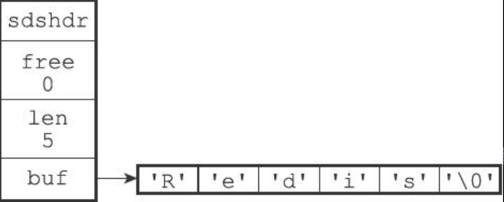
如图，保存了五个字节长的字符串，最后的\0遵循c语言以此结尾，不计入len
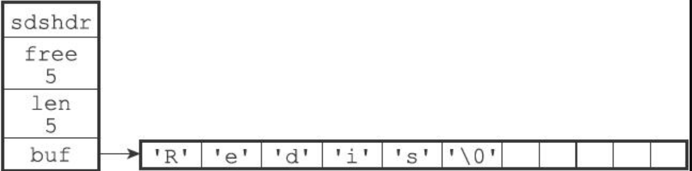
这个为free为5的sds
* 优势
  * O(1)时间复杂度获取字符串长度
  * 记录了len和扩容机制能在strcat时杜绝缓冲区的溢出
  * 减少了修改字符串长度时内存重分配次数
    * 空间预分配 - 在拼接字符时小于1m扩大两倍，大于1m每次够用基础上扩充1m。
    * 惰性空间释放 - 截取时会将剩余空间先留在那，记录在free内，避免频繁分配内存。
  * 二进制安全 - 记录了len解决了\0问题，可以保存音频、图片等文件二进制数据。

### 1.2 链表
* 数据结构定义
```c
typedef struct listNode {
    struct listNode * prev; // 前置节点
    struct listNode * next; // 后驱节点
    void * value; // 节点的值
}listNode;

typedef struct list {
    //表头节点
    listNode * head;
    //表尾节点
    listNode * tail;
    //链表所包含的节点数量
    unsigned long len;
    //节点值复制函数
    void *(*dup)(void *ptr);
    //节点值释放函数
    void (*free)(void *ptr);
    //节点值对比函数
    int (*match)(void *ptr,void *key);
} list;
```
可以看到是一个标准的记录头尾节点和长度的双向链表实现
* 用处  
  应用广泛的数据结构，高效的节点重排能力和顺序性的节点访问方式  
  应用在<font color=red>**当一个列表包含比较多的元素或元素都是较长字符串时**</font>，以及发布订阅、慢查询、监视器等功能。
### 1.3 字典
* 数据结构定义
```c
typedef struct dict {
    //类型特定函数
    dictType *type;
    //私有数据
    void *privdata;
    //哈希表
    dictht ht[2];
    // rehash索引
    //当rehash不在进行时，值为-1
    in trehashidx; /* rehashing not in progress if rehashidx == -1 */
} dict;

typedef struct dictht {
    //哈希表数组
    dictEntry **table;
    //哈希表大小
    unsigned long size;
    //哈希表大小掩码，用于计算索引值
    //总是等于size-1
    unsigned long sizemask;
    //该哈希表已有节点的数量
    unsigned long used;
} dictht;

typedef struct dictEntry {
    //键
    void *key;
    //值
    union{
        void *val;
        uint64_tu64;
        int64_ts64;
    } v;
    //指向下个哈希表节点，形成链表
    struct dictEntry *next;
} dictEntry;
```
可以看出redis的hash实现和常见的有一点点不大一样，它有两个数组以及记录了rehashIndex等

* 用处
也是常用的数据结构，使用hash对象时，<font color=red>**如果一个哈希包含的键值过多或元素都是较长字符串时**，</font>会采用hash表作为底层实现。

* 机制
  * 平常只用ht[0]的哈希表，ht[1]只在rehash时使用
  * 采用MurmurHash2算法计算键的哈希（即使输入的键是有规律的，也能很快给出很好的随机分布）,如图所示的hash,假如hash的值为8，还会经过如下步骤和sizemask做位与运算。
  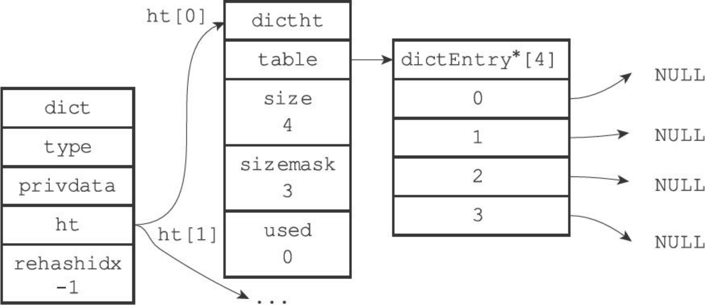
    ```c
    index = hash&dict-＞ht[0].sizemask = 8 & 3 = 0;
    ```
  * 使用链地址头插法解决hash冲突
  * rehash
    * 为ht[1]分配空间，h[0].used*2的第一个2的n次幂或者h[0].used的第一个2的n次幂（对应扩容和收缩）
    * 将h[0]上所有键值对重新hash迁移到ht[1]上
    * 释放ht[0]，将ht[1]变为ht[0]，并新创建ht[1]
    * 在没有bgsave或bgrewriteof时如果负载因子(ht[0].used/ht[0].size)大于等于1时或在bgsave等的时候负载因子大于等于5时会扩容。
    * rehash是渐进式的，如果庞大的键值对同时迁移可能会卡死服务器，所以它维护了rehashIndex，默认-1，开始rehash时为0，在对字典操作时会顺带对ht[0]的数组rehashIndex上的链表做迁移。直到迁移完成。

### 1.4 跳表
* 数据结构定义  
  作为常用数据结构，是一种能快速查找的有序链表延伸，链表在查找时，需顺序遍历，而调表在有序链表的基础上维护若干层上层索引，这样查找时从上向下或向右能达到最差O(n)，平均O(logN)的时间复杂度。
  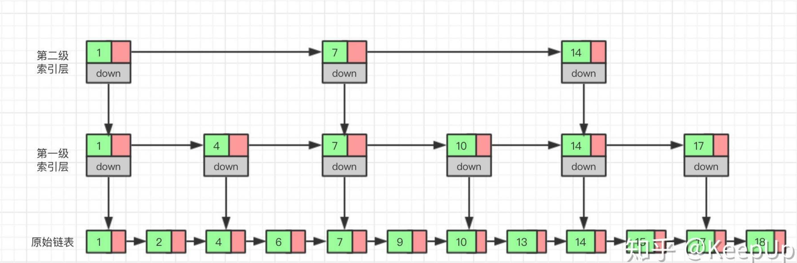
  这也是空间换时间的理念，如图，查找指定元素时，从顶层索引开始，依次和同层后一个节点比较，如果待找值大于后节点值，继续同层向后，如果待找值小于后节点值，则往下一层继续查找。

  redis的实现粗看和理论有些不同，换成下面这张图应该就容易理解一点，同时具体看后续代码说明。
  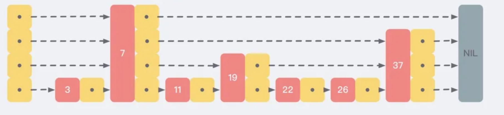
```c
  typedef struct zskiplist {
    //表头节点和表尾节点
    struct zskiplistNode *header, *tail;
    //表中节点的数量
    unsigned long length;
    //表中层数最大的节点的层数
    int level;
} zskiplist;
  
typedef struct zskiplistNode {
    //层
    struct zskiplistLevel {
        //前进指针
        struct zskiplistNode *forward;
        //跨度
        unsigned int span;
    } level[];
    //后退指针
    struct zskiplistNode *backward;
    //分值
    double score;
    //成员对象
    robj *obj;
} zskiplistNode; 
```
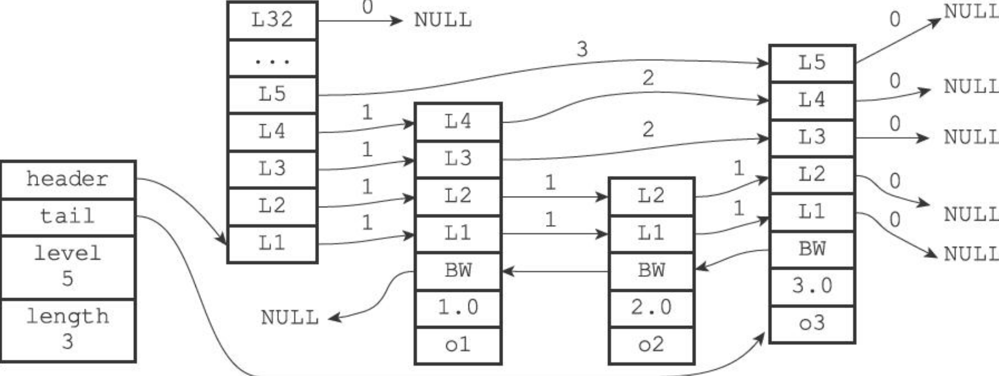
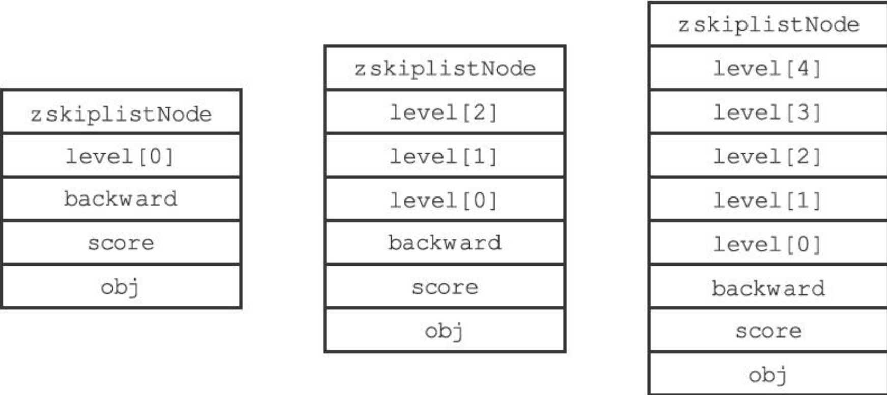

可以看到，首先是level数组，每个level包含下个节点指针和跨度span，如一个值feng 5.0的score，那它可能有三层索引，所以在L1,L2,L3三层上都会记录这个值。而若另一个值wen 9.0的score，可能中间隔着6、7、8三个score，但是6、7、8可能的层数为2，而9.0的层数为5，那此时feng 5.0这个node在L3层上的span跨度就为4，forward指向的就是9.0的L3。

对于新增的节点，每次用随机算法根据幂次定律(或者叫抛硬币概率，连续为正的难度会幂次提升）生成随机的高度，即1/2的几率level=1，1/4几率level=2,1/8几率level=3,1/16几率level=4...依此下去，所以粗略可以看出到32层的几率是很小的，这也是redis定义了最高层数是32的原因，因为够用。
具体算法如下
```c
int zslRandomLevel(void) {
    int level = 1;
    while ((random()&0xFFFF) < (ZSKIPLIST_P * 0xFFFF))
        level += 1;
    return (level<ZSKIPLIST_MAXLEVEL) ? level : ZSKIPLIST_MAXLEVEL;
}
```
查找指定值时就是按之前所说，从最高层依此向右向下一层查找，这样在链表元素很多时，32层的高度查找起来速度要比顺序遍历快很多。

同时记录了表尾节点和后退指针，所以它也支持倒序遍历链表，同时如果分值相同，按值的从小到大正序排列。

* 用处  
作为有序集合底层实现之一，<font color=red>**如果有序集合元素较多或者包含元素是较长字符串时**</font>，redis会采用跳表作为底层实现。
### 1.5 整数数组
* 数据结构定义  
这个结构比较特殊，也蛮有想法的。它是一个按从小到大排序的整数数组，content的元素根据存入元素动态encoding决定存16、32、64位的整数，并且有升级操作，所以是在保证类型不出错的前提下尽可能的节省内存空间。
```c
typedef struct intset {
    //编码方式
    uint32_t encoding;
    //集合包含的元素数量
    uint32_t length;
    //保存元素的数组
    int8_t contents[];
} intset;
```

比如encoding是16位的整数，之前3个数是[1][3][5]，如此，占据了48位的空间，而后续假如来了个-199999999，那会将encoding改为32，同时每个元素占32位空间，并且后续不会降级。[-199999999][1][3][5]。如此
* 用处  
<font color=red>**当一个集合只包含整数值元素，并且这个集合的元素数量不多时，**</font>Redis就会使用整数集合作为集合键的底层实现。  

* 机制
  * 升级规则  
    如上
  

### 1.6 压缩列表
* 数据结构定义  
压缩列表是Redis为了节约内存而开发的，是由一系列特殊编码的连续内存块组成的顺序型（sequential）数据结构。一个压缩列表可以包含任意多个节点（entry），每个节点可以保存一个字节数组或者一个整数值。  
所以它实际上就是一个连续内存块，但是可以保存多个节点，因为是连续内存块所以不会造成内存碎片，同时根据encoding动态取容量和zlbytes等机制，所以它也是为了节省内存设计的数据结构。
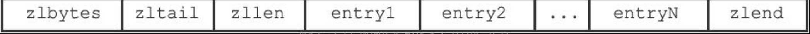
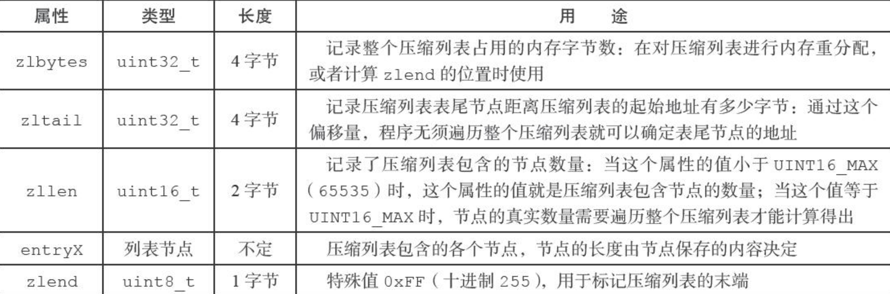

每个entry节点包含content、encoding、previous_entry_length属性。
所以根据zlbytes和zltail的地址以及各个节点中的previous_entry_length可以遍历各个节点。

* 用处   
压缩列表（ziplist）是列表键和哈希键的底层实现之一。<font color=red>**当一个列表键只包含少量列表项，并且每个列表项要么就是小整数值，要么就是长度比较短的字符串，**</font>那么Redis就会使用压缩列表来做列表键的底层实现。

* 问题
  * 连锁更新
ziplist是连续内存块，且每个entry节点内部有content,encoding,previous_entry_length属性。而previous_entry_length属性可以是1或5个字节，假如上一个节点字节长度大于254，则下个节点的previous_entry_length会变成5个字节，从0xFE开头，如0xFE00002766。后面四个字节用于记录前一个entry的长度，0xFE用作标识。这样带来的问题，一种情况是假如有连续250-253字节的entry节点，向其头部插入一个大于254字节的新节点，这样原来的头节点就得将previous_entry_length变为5字节，而因此自身字节长度也会超过254字节。导致下一个节点也会按此操作，这带来的就是后续的节点都会连续更新。
### 1.7 扩展
* redis发展这么些年，当然内部和书本上变化还是蛮大的，比如使用object encoding去查看的话，会发现现在有quickList,listpack等等。放弃了双向链表和压缩列表转而采用listpack和快速列表。具体也可以在conf里配置阈值，如图所示，我在7版本的redis中配置了  
```yaml
list-max-ziplist-size 127
```
效果如下
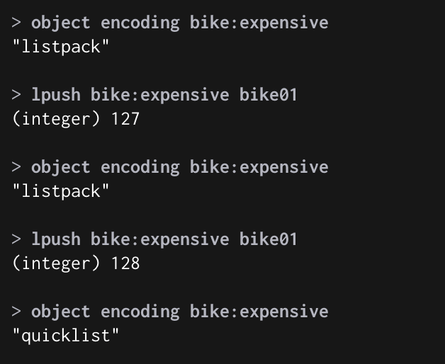
## 2.应用层数据对象

redis并不是直接使用上述数据结构，而是构建了个redisObject对象，因为redis是按键值对来使用的，所以每次新建redis对象的时候都是创建两个对象，分别是键和值，键都是字符串，而值则是redisObject,redisObject有三个属性，分别是type,ptr指针,以及encoding。  
type为string,list,hash,set,zset，而encoding则分为具体的int,embstr,raw,quicklist,listpack,hashtable,intset,skiplist等等。ptr则是具体指针。对应关系如下，当然，新版本已经将ziplist和双端链表换成了listpack和quicklist。
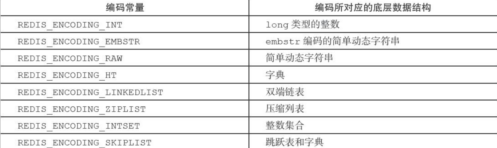
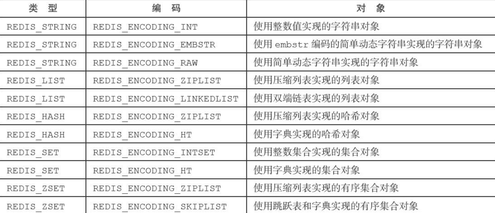


### 2.1 字符串

* 底层数据结构
  * int
  * embstr
  * raw  
字符串的redisObject的encoding会使用上诉三种类型，当long型整数值时，会使用int，而进行append之类操作或float等计算时，会转为raw，当是小于44字节的字符串时，会使用embstr，而进行操作时，会转为raw，大于44字节的字符串时会是raw。区别在于内存分配次数embstr为一次，而raw需要两次，分别分配redisObject和sds的内存。同时embstr没有计算函数，所以每次计算就会转为raw。
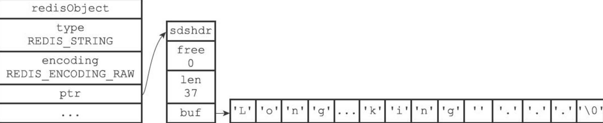

* 常用命令  [详细见这](https://redis.io/commands/?group=string&utm_source=redisinsight&utm_medium=main&utm_campaign=tutorials)
  * set
  * get
  * strlen
  * append
  * incr
  * decr
  * setex
  * setnx
  * getrange
  * setrange
  * ...

### 2.2 列表
在老的版本中，采用了ziplist和linkedlist两种数据结构作为底层实现，但是新版本中已经被替换成了listpack和quicklist。
老的版本ziplist因为上诉所说的连锁更新问题，所以新版本的listpack中将previous_entry_length改为了当前节点的length，同时去除了zltail。这样根据地址同样能遍历并获取到各个节点。同时也没有了连锁更新问题。  
而quickList也是一个有首位项的双向链表，但是链表中的元素不再是具体的字节数组或整数而改成了ziplist，后续则变成了listpack。
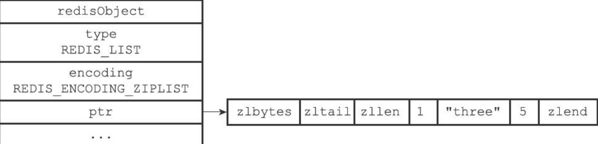

* 底层数据结构
  * zipList
  * linkedList
  * listpack
  * quickList

* 常用命令
  * lpush rpush
  * lpop rpop
  * llen
  * lrange
  * lrem
  * ...
* 配置
  * list-max-ziplist-size
    代表listpack内部大小或entry数量，正数代表数量，-1～-5代表4、8、16、32、64kb，推荐-2即8kb转换为quicklist。
    如配置了-1，用以下脚本插入值。
    ```shell
        # conf地址根据brew安装包下homebrew.mxcl.redis.plist cat查看
        vim /usr/local/etc/redis.conf
        # 修改为-1 即4kb
        list-max-ziplist-size -1

        
    ```

### 2.3 哈希表


### 2.4 集合
### 2.5 有序集合