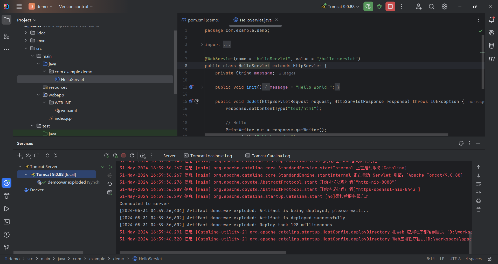
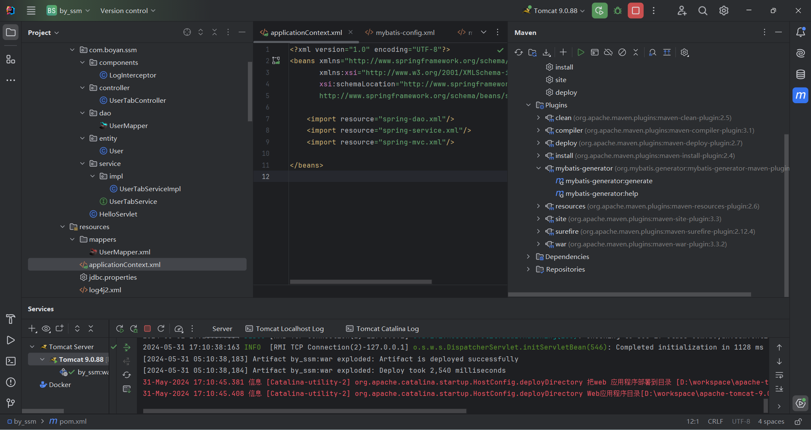
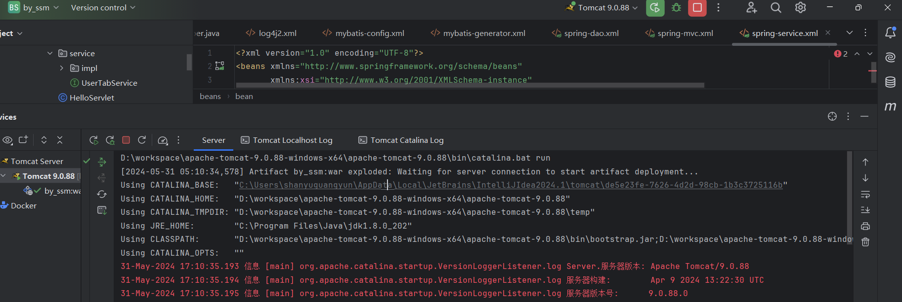

# SSM项目

最近有老项目维护需求，整理了下ssm的步骤。
## 1.搭建步骤

使用idea创建Jakarta EE项目，配置如下  
> Name: projectName  
> Location: D:\workspace\web
> Template: Web Application  
> Application server: Tomcat 9.0.88  
> Language: Java  
> Build system: Maven  
> Group: com.xxx
> Artifact: projectName  
> JDK: 1.8  


Next 选取jakatar版本
> Version: Java EE 8
> Specifications: Servlet (4.0.1)


Create 创建完后目录如下，load maven project后可直接启动tomcat



如果是web应用，采用jsp+servlet编写的话，项目就已经创建好了，但是要集成ssm则要继续调整下。


创建applicationContext.xml
```xml
<?xml version="1.0" encoding="UTF-8"?>
<beans xmlns="http://www.springframework.org/schema/beans"
       xmlns:xsi="http://www.w3.org/2001/XMLSchema-instance"
       xsi:schemaLocation="http://www.springframework.org/schema/beans
       http://www.springframework.org/schema/beans/spring-beans.xsd">

    <import resource="spring-dao.xml"/>
    <import resource="spring-service.xml"/>
    <import resource="spring-mvc.xml"/>

</beans>
```

创建spring-dao.xml
```xml
<?xml version="1.0" encoding="UTF-8"?>
<beans xmlns="http://www.springframework.org/schema/beans"
       xmlns:xsi="http://www.w3.org/2001/XMLSchema-instance"
       xmlns:context="http://www.springframework.org/schema/context"
       xsi:schemaLocation="http://www.springframework.org/schema/beans
       http://www.springframework.org/schema/beans/spring-beans.xsd
       http://www.springframework.org/schema/context
       https://www.springframework.org/schema/context/spring-context.xsd">

    <!-- 配置整合mybatis -->
    <!-- 1.关联数据库文件 -->
    <context:property-placeholder location="classpath:jdbc.properties"/>

    <!-- 2.数据库连接池 -->
    <!--数据库连接池
        dbcp 半自动化操作 不能自动连接
        c3p0 自动化操作（自动的加载配置文件 并且设置到对象里面）
        druid: （企业用得很多）
        hikari:
    -->
    <bean id="dataSource" class="com.zaxxer.hikari.HikariDataSource">
        <!-- 配置连接池属性 -->
        <property name="driverClassName" value="${jdbc.driver}"/>
        <property name="jdbcUrl" value="${jdbc.url}"/>
        <property name="username" value="${jdbc.username}"/>
        <property name="password" value="${jdbc.password}"/>

        <!-- hikari连接池的私有属性 -->
        <property name="maximumPoolSize" value="30"/>
        <property name="minimumIdle" value="10"/>
        <property name="connectionTimeout" value="60000"/>
        <property name="idleTimeout" value="60000"/>
    </bean>

    <!-- 3.配置SqlSessionFactory对象 -->
    <bean id="sqlSessionFactory" class="org.mybatis.spring.SqlSessionFactoryBean">
        <!-- 注入数据库连接池 -->
        <property name="dataSource" ref="dataSource"/>
        <!-- 配置MyBaties全局配置文件:mybatis-config.xml -->
        <property name="configLocation" value="classpath:mybatis-config.xml"/>
    </bean>

    <!-- 4.配置扫描Dao接口包，动态实现Dao接口注入到spring容器中 -->
    <!--解释 ：https://www.cnblogs.com/jpfss/p/7799806.html-->
    <bean class="org.mybatis.spring.mapper.MapperScannerConfigurer">
        <!-- 注入sqlSessionFactory -->
        <property name="sqlSessionFactoryBeanName" value="sqlSessionFactory"/>
        <!-- 给出需要扫描Dao接口包 -->
        <property name="basePackage" value="com.shanyu.ssm.dao"/>
    </bean>

</beans>
```

创建spring-service.xml
```xml
<?xml version="1.0" encoding="UTF-8"?>
<beans xmlns="http://www.springframework.org/schema/beans"
       xmlns:xsi="http://www.w3.org/2001/XMLSchema-instance"
       xmlns:context="http://www.springframework.org/schema/context"
       xmlns:aop="http://www.springframework.org/schema/aop"
       xsi:schemaLocation="http://www.springframework.org/schema/beans
   http://www.springframework.org/schema/beans/spring-beans.xsd
   http://www.springframework.org/schema/context
   http://www.springframework.org/schema/context/spring-context.xsd http://www.springframework.org/schema/aop https://www.springframework.org/schema/aop/spring-aop.xsd">

    <!-- 扫描service相关的bean -->
    <context:component-scan base-package="com.shanyu.ssm.service"/>

    <!-- 配置事务管理器 -->
    <bean id="transactionManager" class="org.springframework.jdbc.datasource.DataSourceTransactionManager">
        <!-- 注入数据库连接池 -->
        <property name="dataSource" ref="dataSource"/>
    </bean>

    <!-- AOP事物支持-->
    <!--日志-->
    <!-- 使用xml配置aop ,引入AOP的命名空间-->
    <bean id="logInterceptor" class="com.shanyu.ssm.components.LogInterceptor">

    </bean>
    <!-- 强制使用cglib代理，如果不设置，将默认使用jdk的代理，但是jdk的代理是基于接口的 -->
    <aop:config proxy-target-class="true"/>
    <aop:config>
        <!--定义切面-->
        <aop:aspect id="logAspect" ref="logInterceptor">
            <!--定义切入点-->
            <aop:pointcut expression="execution(* com.shanyu.ssm.controller.*.*(..))" id="logPointCut"/>
            <!--方法执行之前被调用执行的-->
            <!--<aop:before method="before" pointcut-ref="logPointCut"/>&lt;!&ndash;一个切入点的引用&ndash;&gt;-->
            <!--<aop:after method="after" pointcut-ref="logPointCut"/>&lt;!&ndash;一个切入点的引用&ndash;&gt;-->
            <!--<aop:after-throwing method="afterThrowing" pointcut-ref="logPointCut" />-->
            <!--<aop:after-returning method="afterReturn" pointcut-ref="logPointCut" />-->
            <aop:before method="before" pointcut-ref="logPointCut"/>
        </aop:aspect>
    </aop:config>
</beans>
```

创建spring-mvc.xml
```xml
<?xml version="1.0" encoding="UTF-8"?>
<beans xmlns="http://www.springframework.org/schema/beans"
       xmlns:xsi="http://www.w3.org/2001/XMLSchema-instance"
       xmlns:context="http://www.springframework.org/schema/context"
       xmlns:mvc="http://www.springframework.org/schema/mvc"
       xsi:schemaLocation="http://www.springframework.org/schema/beans
   http://www.springframework.org/schema/beans/spring-beans.xsd
   http://www.springframework.org/schema/context
   http://www.springframework.org/schema/context/spring-context.xsd
   http://www.springframework.org/schema/mvc
   https://www.springframework.org/schema/mvc/spring-mvc.xsd">

    <!-- 配置SpringMVC -->
    <!-- 1.开启SpringMVC注解驱动 -->
    <mvc:annotation-driven />
    <!-- 2.静态资源默认servlet配置-->
    <mvc:default-servlet-handler/>

    <!-- 3.配置jsp 显示ViewResolver视图解析器 -->
    <bean class="org.springframework.web.servlet.view.InternalResourceViewResolver">
        <property name="viewClass" value="org.springframework.web.servlet.view.JstlView" />
        <property name="prefix" value="/WEB-INF/jsp/" />
        <property name="suffix" value=".jsp" />
    </bean>

    <!-- 4.扫描web相关的bean -->
    <context:component-scan base-package="com.shanyu.ssm.controller" />

</beans>
```

创建mybatis-config.xml
```xml
<?xml version="1.0" encoding="UTF-8" ?>
<!DOCTYPE configuration
        PUBLIC "-//mybatis.org//DTD Config 3.0//EN"
        "http://mybatis.org/dtd/mybatis-3-config.dtd">
<configuration>
    <!-- 配置数据源 spring做-->
    <typeAliases>
        <package name="com.shanyu.ssm.entity"/>
    </typeAliases>

</configuration>
```

创建jdbc.properties
```properties
jdbc.driver=com.mysql.cj.jdbc.Driver
jdbc.url=jdbc:mysql://localhost:3306/ssm?useSSL=true&useUnicode=true&characterEncoding=utf8
jdbc.username=root
jdbc.password=root
```

创建log4j2.xml
```xml
<?xml version="1.0" encoding="UTF-8"?>
<configuration  status="info">
    <Properties>
        <property name="APPNAME">by_ssm</property>
        <Property name="logBaseFolder">${sys:catalina.base}/logs/zcrTest/</Property>
        <property name="log_charset">UTF-8</property>
        <property name="log_pattern">
            %d{yyyy-MM-dd HH:mm:ss} [%t] %-5p %c{1}:%L - %msg%n
        </property>
    </Properties>

    <appenders>
        <console name="Console" target="SYSTEM_OUT">
            <PatternLayout pattern="%d{yyyy-MM-dd HH:mm:ss:SSS} %highlight{%-5level} [%t] %highlight{%c{1.}.%M(%L)}: %msg%n"/>
        </console>

        <RollingFile name="RollingFileInfo" fileName="${logBaseFolder}/${APPNAME}-info.log"
                     filePattern="${logBaseFolder}/%d{yyyy-MM}/${APPNAME}-info-%d{dd.HH.mm.ss}.%i.log.gz">
            <ThresholdFilter level="info" onMatch="ACCEPT" onMismatch="DENY"/>
            <PatternLayout charset="${log_charset}" pattern="${log_pattern}" />
            <Policies>
                <TimeBasedTriggeringPolicy  modulate="true" interval="1"/>
                <SizeBasedTriggeringPolicy size="20 MB"/>
            </Policies>
        </RollingFile>

        <RollingFile name="RollingFileError" fileName="${logBaseFolder}/${APPNAME}-error.log"
                     filePattern="${logBaseFolder}/%d{yyyy-MM}/${APPNAME}-error-%d{dd.HH.mm.ss}.%i.log.gz">
            <ThresholdFilter level="error" onMatch="ACCEPT" onMismatch="DENY"/>
            <PatternLayout charset="${log_charset}" pattern="${log_pattern}" />
            <Policies>
                <TimeBasedTriggeringPolicy  modulate="true" interval="1"/>
                <SizeBasedTriggeringPolicy size="20 MB"/>
            </Policies>
        </RollingFile>
    </appenders>

    <loggers>
        <logger name="org.springframework" level="INFO"/>
        <logger name="org.mybatis" level="INFO"/>

        <root level="all">
            <appender-ref ref="Console"/>
            <appender-ref ref="RollingFileInfo"/>
            <appender-ref ref="RollingFileError"/>
        </root>
    </loggers>

</configuration>
```

创建mybatis-generator.xml
```xml
<?xml version="1.0" encoding="UTF-8"?>
<!DOCTYPE generatorConfiguration
        PUBLIC "-//mybatis.org//DTD MyBatis Generator Configuration 1.0//EN"
        "http://mybatis.org/dtd/mybatis-generator-config_1_0.dtd">
<generatorConfiguration>
    <!-- 数据库驱动 -->
    <classPathEntry location="C:\Users\shanyuguangyun\.m2\repository\mysql\mysql-connector-java\8.0.28\mysql-connector-java-8.0.28.jar"/>
    <context id="MysqlTables" targetRuntime="MyBatis3">
        <commentGenerator>
            <property name="suppressDate" value="true"/>
            <!-- 是否去除自动生成的注释 true：是 ： false:否 -->
            <property name="suppressAllComments" value="true"/>
        </commentGenerator>
        <!--数据库链接URL，用户名、密码 -->
        <jdbcConnection driverClass="com.mysql.cj.jdbc.Driver" connectionURL="jdbc:mysql://localhost/ssm"
                        userId="root" password="root">
        </jdbcConnection>
        <javaTypeResolver>
            <property name="forceBigDecimals" value="false"/>
        </javaTypeResolver>
        <!-- 生成模型的包名和位置 -->
        <javaModelGenerator targetPackage="com.shanyu.ssm.entity" targetProject="src/main/java">
            <property name="enableSubPackages" value="true"/>
            <property name="trimStrings" value="true"/>
        </javaModelGenerator>
        <!-- 生成映射文件的包名和位置 -->
        <sqlMapGenerator targetPackage="mappers" targetProject="src/main/resources">
            <property name="enableSubPackages" value="true"/>
        </sqlMapGenerator>
        <!-- 生成DAO的包名和位置 -->
        <javaClientGenerator type="mapper" targetPackage="com.shanyu.ssm.dao" targetProject="src/main/java">
            <property name="enableSubPackages" value="true"/>
        </javaClientGenerator>
        <!-- 要生成的表 tableName是数据库中的表名或视图名 domainObjectName是实体类名 -->
        <table tableName="user_tab" domainObjectName="User" enableCountByExample="false" enableUpdateByExample="false"
               enableDeleteByExample="false" enableSelectByExample="false" selectByExampleQueryId="false"></table>
    </context>
</generatorConfiguration>
```

web.xml替换
```xml
<?xml version="1.0" encoding="UTF-8"?>
<web-app xmlns="http://xmlns.jcp.org/xml/ns/javaee"
         xmlns:xsi="http://www.w3.org/2001/XMLSchema-instance"
         xsi:schemaLocation="http://xmlns.jcp.org/xml/ns/javaee http://xmlns.jcp.org/xml/ns/javaee/web-app_4_0.xsd"
         version="4.0">

    <!--DispatcherServlet-->
    <servlet>
        <servlet-name>DispatcherServlet</servlet-name>
        <servlet-class>org.springframework.web.servlet.DispatcherServlet</servlet-class>
        <init-param>
            <param-name>contextConfigLocation</param-name>
            <!--加载总配置文件-->
            <param-value>classpath:applicationContext.xml</param-value>
        </init-param>
        <load-on-startup>1</load-on-startup>
    </servlet>
    <servlet-mapping>
        <servlet-name>DispatcherServlet</servlet-name>
        <url-pattern>/</url-pattern>
    </servlet-mapping>

    <!--encodingFilter-->
    <filter>
        <filter-name>encodingFilter</filter-name>
        <filter-class>
            org.springframework.web.filter.CharacterEncodingFilter
        </filter-class>
        <init-param>
            <param-name>encoding</param-name>
            <param-value>utf-8</param-value>
        </init-param>
    </filter>
    <filter-mapping>
        <filter-name>encodingFilter</filter-name>
        <url-pattern>/*</url-pattern>
    </filter-mapping>

    <!--Session过期时间-->
    <session-config>
        <session-timeout>15</session-timeout>
    </session-config>

    <!--日志-->
    <!-- log4j2-begin-->
    <!--监听器和过滤器-->
    <listener>
        <listener-class>org.apache.logging.log4j.web.Log4jServletContextListener</listener-class>
    </listener>

    <filter>
        <filter-name>log4jServletFilter</filter-name>
        <filter-class>org.apache.logging.log4j.web.Log4jServletFilter</filter-class>
    </filter>
    <filter-mapping>
        <filter-name>log4jServletFilter</filter-name>
        <url-pattern>/*</url-pattern>
        <dispatcher>REQUEST</dispatcher>
        <dispatcher>FORWARD</dispatcher>
        <dispatcher>INCLUDE</dispatcher>
        <dispatcher>ERROR</dispatcher>
    </filter-mapping>

    <context-param>
        <param-name>log4jConfiguration</param-name>
        <param-value>classpath:log4j2.xml</param-value>
    </context-param>
    <!--动态修改log4j2.xml：容器会每60秒扫描log4j的配置文件-->
    <context-param>
        <param-name>log4jRefreshInterval</param-name>
        <param-value>60000</param-value>
    </context-param>
    <!-- log4j2-end -->

</web-app>
```

pom.xml依赖
```xml
<?xml version="1.0" encoding="UTF-8"?>
<project xmlns="http://maven.apache.org/POM/4.0.0"
         xmlns:xsi="http://www.w3.org/2001/XMLSchema-instance"
         xsi:schemaLocation="http://maven.apache.org/POM/4.0.0 https://maven.apache.org/xsd/maven-4.0.0.xsd">
    <modelVersion>4.0.0</modelVersion>

    <groupId>com.shanyu</groupId>
    <artifactId>by_ssm</artifactId>
    <version>1.0-SNAPSHOT</version>
    <name>demo</name>
    <packaging>war</packaging>

    <properties>
        <project.build.sourceEncoding>UTF-8</project.build.sourceEncoding>
        <maven.compiler.target>1.8</maven.compiler.target>
        <maven.compiler.source>1.8</maven.compiler.source>
        <junit.version>5.9.2</junit.version>
    </properties>

    <dependencies>
        <dependency>
            <groupId>javax.servlet</groupId>
            <artifactId>javax.servlet-api</artifactId>
            <version>4.0.1</version>
            <scope>provided</scope>
        </dependency>
        <dependency>
            <groupId>org.junit.jupiter</groupId>
            <artifactId>junit-jupiter-api</artifactId>
            <version>${junit.version}</version>
            <scope>test</scope>
        </dependency>
        <dependency>
            <groupId>org.junit.jupiter</groupId>
            <artifactId>junit-jupiter-engine</artifactId>
            <version>${junit.version}</version>
            <scope>test</scope>
        </dependency>

        <!--数据库驱动-->
        <dependency>
            <groupId>mysql</groupId>
            <artifactId>mysql-connector-java</artifactId>
            <version>8.0.28</version>
        </dependency>
        <!-- 数据库连接池 -->
        <dependency>
            <groupId>com.zaxxer</groupId>
            <artifactId>HikariCP</artifactId>
            <version>2.7.7</version>
        </dependency>

        <!--Mybatis-->
        <dependency>
            <groupId>org.mybatis</groupId>
            <artifactId>mybatis</artifactId>
            <version>3.5.6</version>
        </dependency>
        <dependency>
            <groupId>org.mybatis</groupId>
            <artifactId>mybatis-spring</artifactId>
            <version>2.0.2</version>
        </dependency>

        <!--Spring-->
        <dependency>
            <groupId>org.springframework</groupId>
            <artifactId>spring-webmvc</artifactId>
            <version>5.1.9.RELEASE</version>
        </dependency>
        <dependency>
            <groupId>org.springframework</groupId>
            <artifactId>spring-jdbc</artifactId>
            <version>5.1.9.RELEASE</version>
        </dependency>
        <dependency>
            <groupId>org.springframework</groupId>
            <artifactId>spring-aop</artifactId>
            <version>5.1.9.RELEASE</version>
        </dependency>
        <dependency>
            <groupId>org.aspectj</groupId>
            <artifactId>aspectjweaver</artifactId>
            <version>1.9.5</version>
        </dependency>
        <!--Lombok-->
        <dependency>
            <groupId>org.projectlombok</groupId>
            <artifactId>lombok</artifactId>
            <version>1.16.10</version>
        </dependency>

        <!--log4j-->
        <dependency>
            <groupId>org.apache.logging.log4j</groupId>
            <artifactId>log4j-core</artifactId>
            <version>2.14.1</version>
        </dependency>
        <dependency>
            <groupId>org.apache.logging.log4j</groupId>
            <artifactId>log4j-web</artifactId>
            <version>2.14.1</version>
        </dependency>
        <dependency>
            <groupId>org.apache.logging.log4j</groupId>
            <artifactId>log4j-slf4j-impl</artifactId>
            <version>2.14.1</version>
        </dependency>
    </dependencies>

    <build>
        <!-- build配置resources,防止我们资源导出失败-->
        <resources>
            <resource>
                <directory>src/main/resources</directory>
                <includes>
                    <include>**/*.properties</include>
                    <include>**/*.xml</include>
                </includes>
                <filtering>false</filtering>
            </resource>
            <resource>
                <directory>src/main/java</directory>
                <includes>
                    <include>**/*.properties</include>
                    <include>**/*.xml</include>
                </includes>
                <filtering>false</filtering>
            </resource>
        </resources>
        <plugins>
            <plugin>
                <groupId>org.apache.maven.plugins</groupId>
                <artifactId>maven-war-plugin</artifactId>
                <version>3.3.2</version>
            </plugin>
            <plugin>
            <groupId>org.mybatis.generator</groupId>
            <artifactId>mybatis-generator-maven-plugin</artifactId>
            <version>1.3.7</version>
            <dependencies>
                <dependency>
                    <groupId>mysql</groupId>
                    <artifactId>mysql-connector-java</artifactId>
                    <version>8.0.28</version>
                </dependency>
            </dependencies>
            <configuration>
                <!--允许移动生成的文件-->
                <verbose>true</verbose>
                <!--允许自动覆盖文件,第一次可覆盖，以后都不可覆盖-->
                <overwrite>true</overwrite>
                <!-- 自定义配置文件的名称  默认是generatorConfig.xml -->
                <configurationFile>
                    src/main/resources/mybatis-generator.xml
                </configurationFile>
            </configuration>
            </plugin>
        </plugins>
    </build>
</project>
```

日志切面
```java
@Slf4j
@Component
public class LogInterceptor {

    public void before(JoinPoint point) {
        ServletRequestAttributes attributes = (ServletRequestAttributes) RequestContextHolder.getRequestAttributes();
        if (attributes == null) {
            throw new IllegalArgumentException("解析请求错误");
        }
        HttpServletRequest request = attributes.getRequest();

        log.info("用户操作日志:\n  url:{}\n  ip:{}\n  参数:{}",
                request.getRequestURI(),
                request.getRemoteAddr(),
                point.getArgs());
    }
}

```

测试sql
```sql
CREATE TABLE user_tab(
id int not null primary key auto_increment comment 'id主键',
phone varchar(11) not null comment '手机号',
password varchar(20) not null comment '密码',
name varchar(20) not null comment '姓名',
nickname varchar(20) not null comment '昵称',
age tinyint not null comment '年龄',
gender bit not null default b'0' comment '性别1-男，0-女',
address varchar(127) not null default '' comment '地址',
profession varchar(255) not null default '' comment '专业',
introduction varchar(255) not null default '' comment '介绍',
status bit not null default b'0' comment '状态1-启用,0-禁止',
create_time timestamp not null default current_timestamp,
update_time timestamp not null default current_timestamp on update current_timestamp
);
```

## 2.使用mybatis-generator创建entity、mapper、和mapper.xml

在上面已经配置了mybatis-generator.xml和maven plugin。执行完建表语句后生成mapper和对应实体类即可。



## 3.创建controller编写代码
```java
@RestController
@RequestMapping("/user")
public class UserTabController {

    public static final Logger logger = LoggerFactory.getLogger(UserTabController.class);

    @GetMapping
    public String findAllUser() {
        logger.info("日志正常");
        return "none user here";
    }

}
```


## 4.补充

### 4.1 log4j2配置

log4j2一般定义多个appenders，如console、infoFile、errorFile之类。
然后在loggers中指定本次会输出到的appender，如只使用console，就只会在控制台输出。
root中指定日志级别。
同时可以使用logger指定level去更细维度某些特殊包的日志级别。
```xml
<loggers>
    <!--过滤掉spring和mybatis的一些无用的DEBUG信息-->
    <logger name="org.springframework" level="INFO"/>
    <logger name="org.mybatis" level="INFO"/>

    <root level="INFO">
        <appender-ref ref="Console"/>
        <appender-ref ref="RollingFileInfo"/>
    </root>
</loggers>
```

彩色控制台日志需要在vm options中加入
```shell
-Dlog4j.skipJansi=false
```

要使用slf4j控制log4j只需要使用这个pom配置即可。
```xml
<dependency>
    <groupId>org.apache.logging.log4j</groupId>
    <artifactId>log4j-core</artifactId>
    <version>2.14.1</version>
</dependency>
<dependency>
    <groupId>org.apache.logging.log4j</groupId>
    <artifactId>log4j-web</artifactId>
    <version>2.14.1</version>
</dependency>
<!-- 该包中有log4j-api -->
<dependency>
    <groupId>org.apache.logging.log4j</groupId>
    <artifactId>log4j-slf4j-impl</artifactId>
    <version>2.14.1</version>
</dependency>
```

### 4.2 IDEA中Tomcat

通过IDEA配置的Tomcat启动项目，会在 CATALINA_BASE下生成一个新的配置实例，里面有work、conf、logs等等。  
在tomcat启动的开始会打印出使用的CATALINA_BASE目录。实际上war包就是丢在该目录里执行的，并且logging.properties等也是使用该目录内容配置。


同时，如果tomcat控制台乱码，则修改如下地方。

1.IDEA中
* File | Settings | Editor | General | Console 将Default Encoding改为UTF-8
* File | Settings | Editor | File Encodings 将所有都改为UTF-8
* Help | Edit Customer VM Options  最后加入 -Dfile.encoding=UTF-8

2.Tomcat中
* CATALINA_BASE和CATALINA_HOME中的conf/logging.properties将所有改为UTF-8

CATALINA_HOME是tomcat源文件目录
CATALINA_BASE是tomcat当前使用的一些配置目录，其他共享的HOME目录下文件。

重启IDEA


