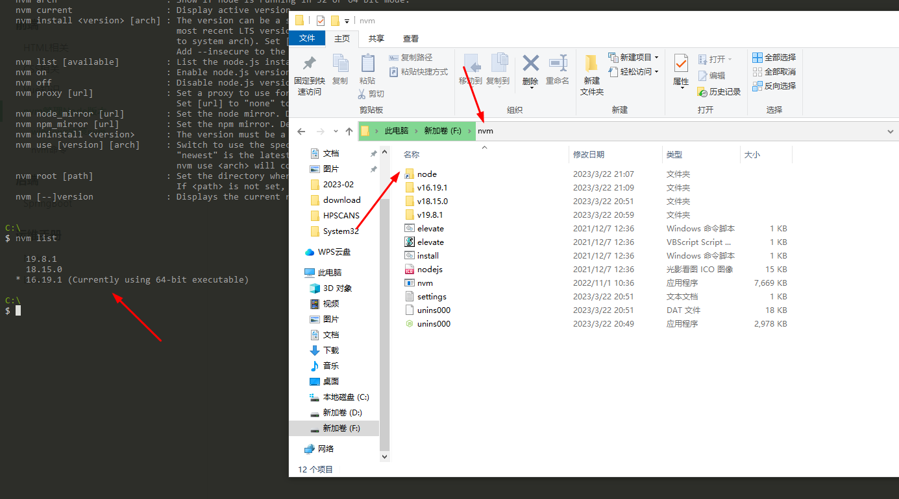

# nvm管理Node版本


## windows安装nvm

nvm介绍
> 由于node版本变化较大，可能同时有几个项目在开发，每次因版本原因重新装node耗费时间，nvm能管理电脑上的node，方便切换和使用。
> nvm官网[nvm官网](https://nvm.uihtm.com/),[nvm下载地址](https://github.com/coreybutler/nvm-windows/releases)

容易出问题的地方
> 下载前请删除机器上的node和环境变量。


nvm use xx.xx.xx不起作用
> nvm安装完后，可能出现nvm不能正常使用node,原因是请先创建空的nvm文件夹，以及在nvm文件夹下创建node文件夹，然后指定root和path为这两个文件夹即可。

文件夹结构如下



## nvm命令
[node版本历史](https://nodejs.org/en/download/releases)

```shell
nvm ls

# 安装lts版本
nvm install lts

# 安装最新版本
nvm install latest

# 使用稳定版本
nvm use lts

# 使用最新版本
nvm use latest

# 使用指定版本，安装同理
nvm use xx.xx.xx

# 查看当前版本
nvm current
```
