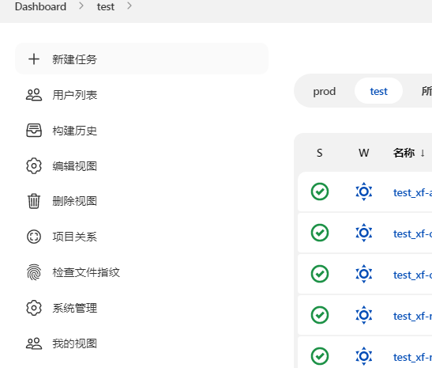
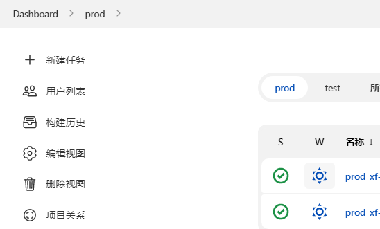
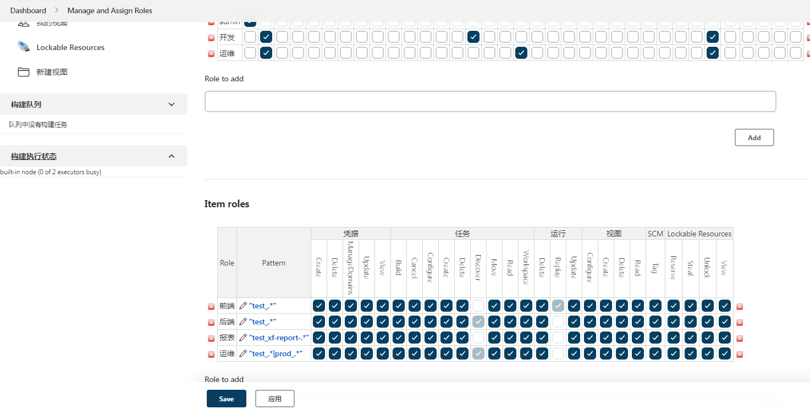

# Jenkins


## 安装
Jenkins官网下载所需版本的war包即可[下载地址](https://jenkins.io/zh/download/)(推荐下载LTS即长期支持版本问题会比较少)
或者查看[官网](https://pkg.jenkins.io/redhat-stable/)，使用wget等安装都可

jenkins并未给启动命令，所以可以自己写一个脚本避免每次都用命令查找kill。
```shell
#!/bin/bash
pid=`ps -ef | grep jenkins.war | grep -v 'grep'| awk '{print $2}'| wc -l`
if [ "$1" = "start" ];then
        if [ $pid -gt 0 ];then
    echo 'jenkins is running...'
    else
    java -jar jenkins.war --httpPort=8888 >/dev/null 2>&1 &
        fi
elif [ "$1" = "stop" ];then
        exec ps -ef | grep jenkins | grep -v grep | awk '{print $2}'| xargs kill -9
    echo 'jenkins is stop..'
else
        echo "Please input like this:"./jenkins.sh start" or "./jenkins stop""
fi
```

使用方式
```shell
./jenkins.sh stop
./jenkins.sh start
```


## 工作流程

1. 拉取gitlab上代码(可指定分支，使用插件)
2. 本地shell构建获取jar包或者dist文件夹
3. ssh发送到远程服务器(可先本地打成zip文件)
4. 在远程服务器上执行shell,运行项目

## 配置步骤

### 1. 步骤
1. 新建任务,选自由风格，输入名称
2. 填入描述，选中丢弃旧的构建，天数和最大个数都填1
3. 选中参数化构建过程，选择git参数，名称填checkBranch，描述填选择要部署的分支或tag，参数类型选择分支或标签，默认值填origin/master
4. 源码管理->Repository URL填项目地址，选Credentials。Branches to build指定分支填$checkBranch。源码库浏览器选gitlab,version填10.0
5. 构建，分前后端
   1. 后端项目
      1. 选调用顶层maven目标
      2. 选maven版本
      3. 目标填clean install -Dmaven.test.skip=true
      4. 增加构建步骤，选Execute shell script on remote host using ssh执行shell
      5. ssh site选jenkins服务器
      6. command填,将jar包打成zip包(可选),因为jar本身就是压缩包
          ```shell
           cd /root/.jenkins/workspace/test_demoProject/target
           zip -q -r demoProject.zip ./demoProject-1.0.0.jar
           ```
    2. 前端项目
       1. 选执行shell，直接用shell打包即可，后端其实也可以如此操作
       ```shell
        cd /root/.jenkins/workspace/test_demoProject
        /usr/local/node-v13.14.0-linux-x64/bin/npm install
        /usr/local/node-v13.14.0-linux-x64/bin/npm run build
        echo 'build success, start move directory'
        zip -q -r demoProject.zip ./dist/
        echo 'zip success'
       ```
       2. 同时前端项目的下一步操作中Source files直接填demoProject.zip, Remove prefix为空，remote directory填 /demoProject
       3. 前端的下一步中Exec command不同，将文件解压到nginx的html目录即可，对应的nginx的root也要配置到demoProject文件夹下
       ```shell
        cd /usr/local/nginx
        rm -rf ./demoProject
        unzip -o -d /usr/local/nginx /opt/jenkins/demoProject/demoProject.zip 
        mv dist/ demoProject/
        cd /opt/jenkins/demoProject
        mv demoProject.zip ./version
        cd version/
        mv demoProject.zip ./demoProject-$(date +%Y%m%d-%H%M).zip 
       ``` 
6. 构建后操作选Send build artifacts over SSH
   1. SSH Publishers
      1. SSH Server选要部署到的机器
      2. Transfers Source files填 target/demoProject.zip, Remove Prefix填target/, Remote Directory填 /demoProject (发送到运行服务器的指定文件夹) Exec command填，意思是进入运行服务器该目录,删掉上一个jar包,将发送过来的zip包解压，然后备份到version目录下，执行启动程序脚本
      ```shell
        cd /opt/jenkins/demoProject
        rm -rf demoProject-1.0.0.jar
        unzip -o -d /opt/jenkins/demoProject /opt/jenkins/demoProject/demoProject.zip
        mv demoProject.zip ./version/demoProject-$(date +%Y%m%d-%H%M).zip
        ./start.sh
      ```
7. 增加构建后操作Delete workspace when build is done,不然服务器磁盘很快就会满

### 2. start.sh
由于我的后端程序都托管给了supervisor,所以我的脚本如下。要注意的是java的jar包一定要指定好为1.0.0版本。约定好配置
关于supervisor的配置，请看我另一篇文章[supervisor](./supervisor.md)

```shell
#!/bin/bash
JAR_PATH='/opt/jenkins/demoProject'

JAR_NAME=demoProject-1.0.0.jar

cd ${JAR_PATH}

pid=`ps -ef|grep demoProject|grep -v 'grep'|awk '{print $2}'`
if [ -n "$pid" ]
then
  echo 'Now Ready to restart demoProject application.'
  supervisorctl restart demoProject
else
  echo 'Dont found the demoProject application. now ready to start it'
  supervisorctl start demoProject
fi
echo 'Server started successfuly...'
```

### 3.jenkins全局配置
对于上诉操作，其中需要用到ssh和git插件、以及maven配置和gitlab的Credentials。这些都需在jenkins中提前配置好。
其中我的一些配置如下
* 全局工具配置
  * git配置 path to git executable为/usr/bin/git，这些其实有需要的就配，没需要直接用系统默认的就好，如jdk、git、maven等工具的配置
* 插件管理
  * Git plugin # 拉代码肯定需要
  * Publish Over SSH # 通过ssh免密传输文件需要
  * Maven Integration plugin # 构建maven项目
  * Git Parameter # 针对不同分支进行部署需要
  * Manage and Assign Roles # 给不同用户分配不同菜单视图需要
* 系统配置
  * Publish over SSH
* Manage Credentials
  * 这里的凭据自己按情况配置，如拉代码要gitlab的账号密码，直接使用username with password就ok

publish over ssh配置如下，jenkins服务器生成ssh key，将id_rsa私钥放入jenkins的key中，同时path也填上。下方新增ssh server,填写名称和hostname.
填上用户名如root,以及远程目录，这个目录就是传输文件的父目录，如我的都是/opt/jenkins

## 角色分配
通常，公司内需分测试环境、灰度和生产环境，针对不同的人员，可能只允许其部署某个环境的代码。
比如给测试分配灰度、给开发分配测试环境、运维则是所有环境。

而这种操作，我借助的是Manage and Assign Roles这个插件，同时因为针对每个环境，项目部署的地址不同。所以我采取的方案如下。

针对同一个项目，采取test_和prod_开头新建任务，test_xxx代表这个项目的测试任务。prod_xxx代表这个项目的生产任务。同时新建视图prod、test将任务隔离开。
然后在角色管理中新增不同角色，使用正则匹配不同的项目，给不同成员分配不同的角色即可。需注意的是jenkins分为全局角色和子角色，需自行了解配置。






## 使用webhook自动部署
在项目配置中，构建触发器，勾选Build when a change is pushed to GitLab. GitLab webhook URL:
同时高级->生成screct token。将URL和token拷贝。去到gitlab项目中,Settings->Integrations。将URL和token拷贝至其中，新增webhook.
这样一来，每次项目代码只要推到远程，就会触发自动部署。


## 常用命令
```shell
 // 启动进程
 nohup java -jar /usr/share/java/jenkins.war --httpPort=9897 &
 
 // 杀死进程
 netstat -ntpl
 kill -9 pid
 
 // 或者
 ps -ef | grep jenkins.war | grep -v grep | awk '{print $2}' | xargs kill -9i
```

