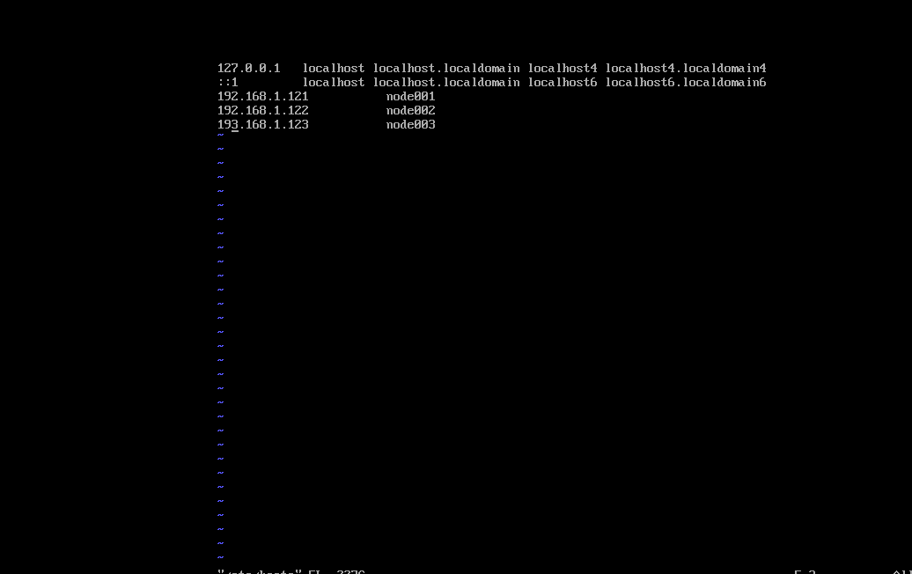

# VMware

## 1.安装

> 学习可用VMware Workstation Player,这个是免费的。下载不需要注册。
> VMware Workstation Pro我这里用的15的版本。下载需要注册
> [下载地址](https://customerconnect.vmware.com/en/downloads/search?query=vmware%20workstation%20pro%2015)直接搜索即可
> 下载完成后安装iso镜像等等创建虚拟机步骤省略了


## 2.配置网络

> 网络配置我这里用的NAT模式和静态ip。

> 查看网关
> 打开编辑-虚拟网络编辑器(player没有该界面)


> 编辑network-scripts，注意下这个配置，dns1和网关配成一样的，ip取网段内的就ok，BOOTPROTO改为static
```shell
vi /etc/sysconfig/network-scripts/ifcfg-ens33

# 重启网络
service network restart
```


> 关闭防火墙
```shell
systemctl status firewalld
systemctl stop firewalld
# 关闭开机自启动
systemctl disable firewalld
systemctl status firewalld
```

测试ping宿主机ip

> 安装net-tools
```shell
yum install net-tools
```

## 3.一些常用包，vim ssh jdk配置
> 安装vim
```shell
yum install vim
```

> 生成ssh
```shell
cd ~
mkdir .ssh
ssh-keygen -t rsa
cat id_rsa.pub >> authorized_keys
chmod 600 authorized_keys
```

> 安装jdk，[下载地址](https://www.oracle.com/java/technologies/downloads/#java8)，选最下面x64.tar.gz
```shell
# 上传tar包
scp scp ./jdk-8u361-linux-x64.tar.gz root@192.168.1.121:/home/software/jdk-8u361-linux-x64.tar.g
tar -zxvf jdk-8u361-linux-x64.tar.gz
```

> 配置环境变量
```shell
vim /etc/profile
```

```shell
# 最下方加入
export JAVA_HOME=/home/software/jdk1.8.0_361  
export JRE_HOME=${JAVA_HOME}/jre  
export CLASSPATH=.:${JAVA_HOME}/lib:${JRE_HOME}/lib  
export PATH=${JAVA_HOME}/bin:$PATH
```

> source让环境变量立即生效
```shell
# 使配置生效
source /etc/profile
```

> 验证
```shell
java -version
```

## 4.修改hostname

```shell
vim /etc/hostname
# 我这改为node001，查看
hostnamectl
```

> 修改hosts
```shell
vim /ect/hosts

# 新增
node001 192.168.1.121
```

## 5.克隆虚拟机

> 虚拟机-管理-克隆（需关闭虚拟机）
> 克隆出node002 node003 ...
> 修改network-scripts ipaddr
> 修改hosts
> 修改hostname
> 删除重新ssh-keygen



## 6.ssh-id-copy

> 以下命令将公钥分别加入另外两台机器，之后scp就无需输密码了。
```shell
ssh-copy-id -i ~/.ssh/id_rsa.pub root@node002
ssh-copy-id -i ~/.ssh/id_rsa.pub root@node003

# 测试
scp /home/software/hello.sh node002:/home/software/hello.sh
```
