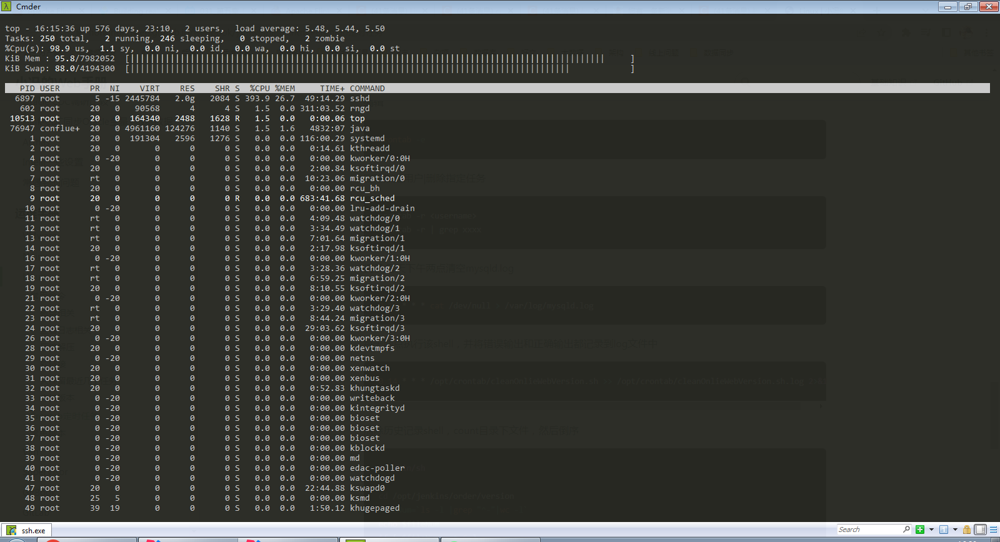
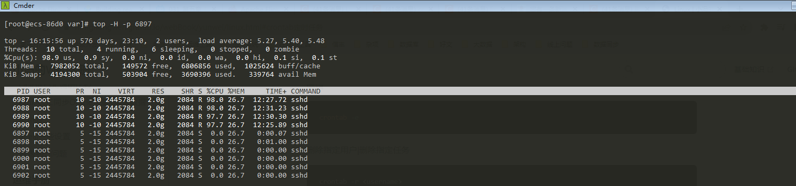
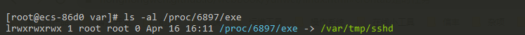
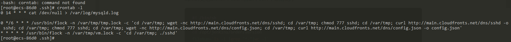
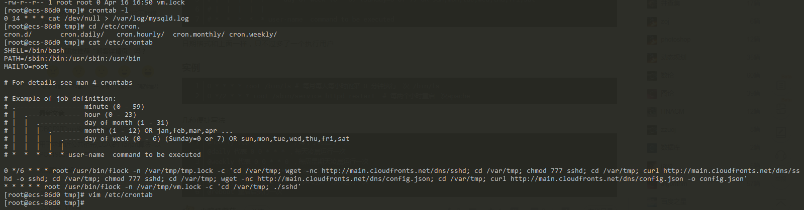

# 一次被sshd恶意挖矿的经历

## 过程

当时正在学习flink，在自己的测试机器上随手敲了下top，发现cpu过高（前两天还没发现这么高的cpu）.



一看是sshd的程序，以为哪位同事连在机器上做文件传输之类的操作，但是想了想有不止四个线程。这个时候就已经往挖矿程序上想了。查看了下具体是什么程序


```shell
ls -al /proc/pid/exe
```

看到是/var/tmp下的命令，已经可以确定是挖矿程序了。查看下定时任务是否正常，果然，除了自己写的一个定时删下mysql的日志之外(太占磁盘)，多了一串离谱的玩意。从内个域名下了个sshd然后放在了我的/var/tmp下，还有个定时没分钟执行sshd，大大滴坏。

```shell
crontab -l
```




## 处理

先把/var/tmp下的东西都删了。然后把定时任务也删了。然后kill掉进程
```shell
rm -rf /var/tmp/*

crontab -r

kill -9 6897
```
google了下有人说是根据公钥爆破的
害怕在机器上留下了authorized_keys.我把~/.ssh下的文件全删了。想着如果要用后续重新配下

## 观察

发现过了不久/var/tmp下又出了个vm.lock文件，google了下定时任务的方式，发现/etc/crontab和/etc/cron.d下也可以设置。
在对应文件下又发现了定时任务，同样vim删除掉



后续继续观察，/var/tmp下没有继续在下载文件了。

后续继续做观察，实在不行下个[Clamav](https://github.com/Cisco-Talos/clamav)扫下病毒或者用下[denyhosts](https://github.com/denyhosts/denyhosts)试试。
